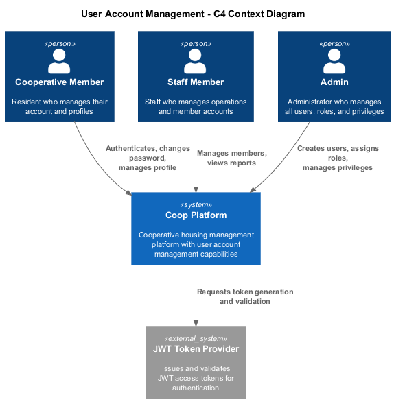
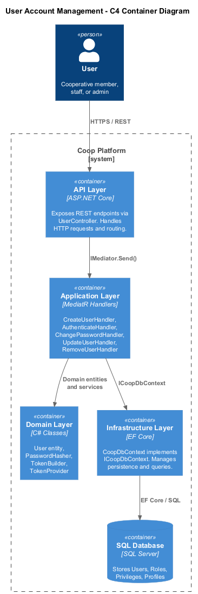
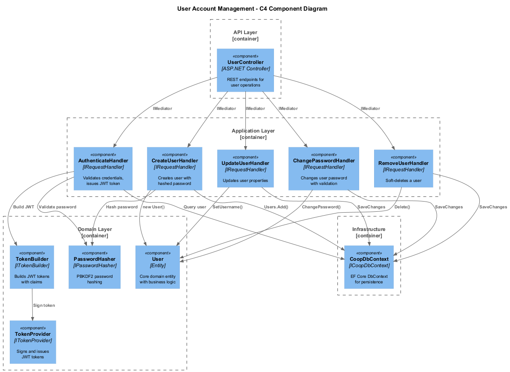
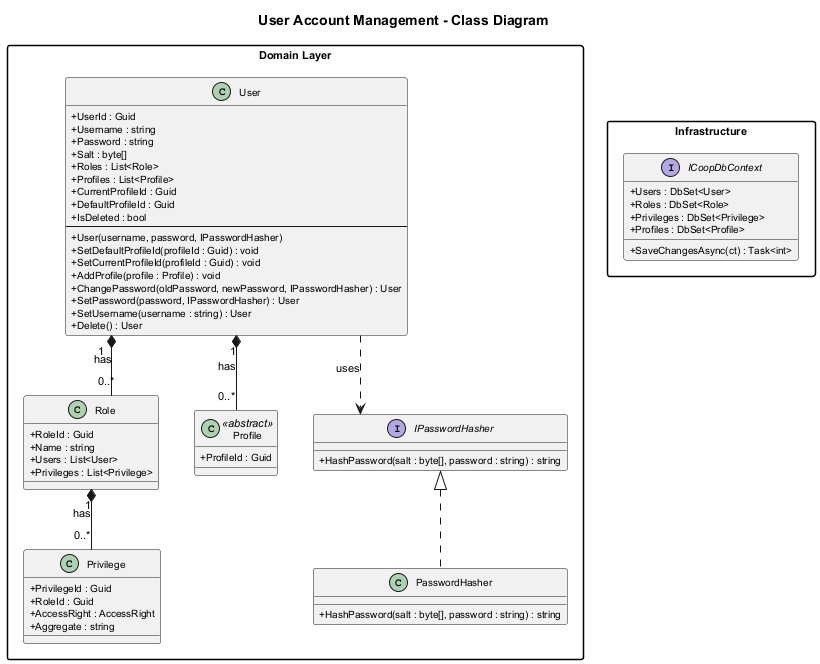
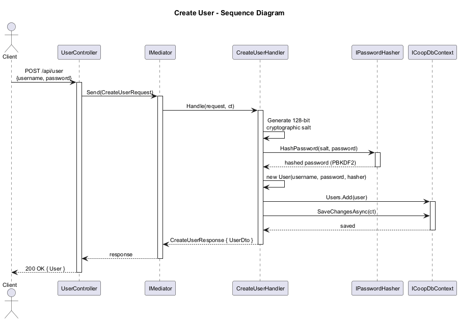
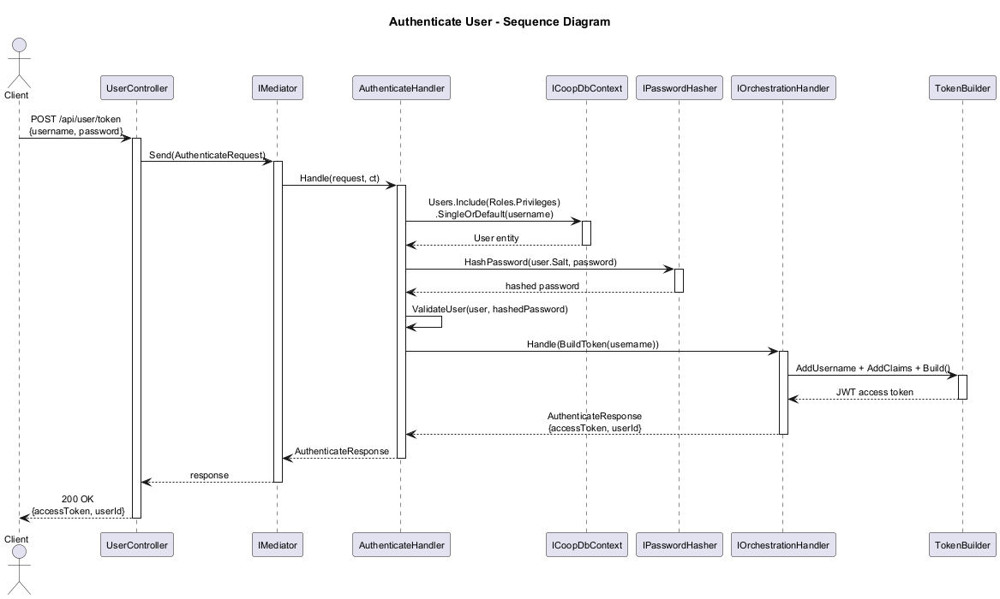
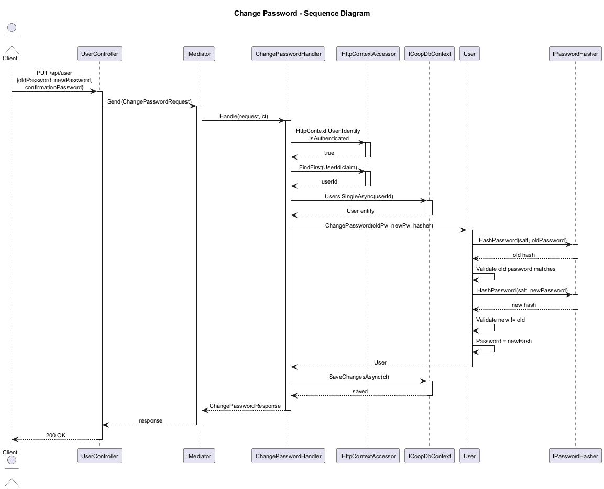
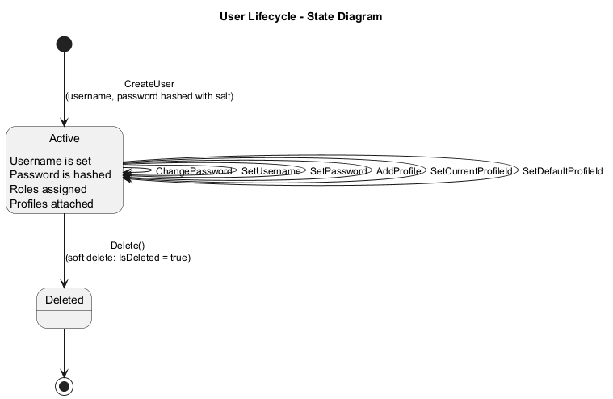

# User Account Management - Detailed Design

## 1. Overview

The User Account Management feature provides the core identity and authentication capabilities for the Coop cooperative housing management platform. It enables user creation with secure password hashing, JWT-based authentication, password management, profile association, and role-based access control.

The feature follows a clean architecture pattern with four distinct layers:

- **API Layer** - ASP.NET Core controllers exposing REST endpoints
- **Application Layer** - MediatR command/query handlers implementing CQRS
- **Domain Layer** - Core business entities and domain services
- **Infrastructure Layer** - EF Core persistence via `CoopDbContext`

### Key Capabilities

- User registration with cryptographically salted password hashing (PBKDF2)
- JWT token-based authentication
- Password change with old-password validation
- Username updates
- Profile association and default/current profile management
- Role and privilege-based authorization
- Soft deletion of user accounts

---

## 2. Architecture Diagrams

### 2.1 C4 Context Diagram

The context diagram shows the Coop Platform and its interactions with external actors and systems.



Three primary actor types interact with the platform:
- **Cooperative Member** - Authenticates, manages their own profile and password
- **Staff Member** - Manages members and operational data
- **Admin** - Full user management including creation, role assignment, and privilege configuration

The platform delegates token signing and validation to the JWT Token Provider subsystem.

### 2.2 C4 Container Diagram

The container diagram illustrates the internal layered architecture of the platform.



Requests flow from the API Layer through MediatR-dispatched handlers in the Application Layer, which coordinate Domain Layer entities and Infrastructure Layer persistence.

### 2.3 C4 Component Diagram

The component diagram details the individual classes and their relationships within the User Account Management feature.



---

## 3. Components

### 3.1 Domain Layer

#### 3.1.1 User Entity

The `User` class is the core aggregate for account management. It encapsulates all identity-related state and behavior.

| Property | Type | Description |
|---|---|---|
| `UserId` | `Guid` | Primary key, auto-generated |
| `Username` | `string` | Unique login identifier |
| `Password` | `string` | PBKDF2-hashed password (Base64 encoded) |
| `Salt` | `byte[]` | 128-bit cryptographic salt (per-user) |
| `Roles` | `List<Role>` | Assigned roles for authorization |
| `Profiles` | `List<Profile>` | Associated profiles (Member, StaffMember, BoardMember) |
| `CurrentProfileId` | `Guid` | Currently active profile |
| `DefaultProfileId` | `Guid` | Default profile set on first profile addition |
| `IsDeleted` | `bool` | Soft-delete flag |

**Methods:**

- `SetDefaultProfileId(Guid)` - Sets the default profile
- `SetCurrentProfileId(Guid)` - Switches the active profile
- `AddProfile(Profile)` - Adds a profile; auto-sets current/default if first profile
- `ChangePassword(oldPassword, newPassword, IPasswordHasher)` - Validates old password, rejects same-password changes, updates hash
- `SetPassword(password, IPasswordHasher)` - Directly sets a new password hash (admin reset)
- `SetUsername(string)` - Updates the username
- `Delete()` - Soft-deletes by setting `IsDeleted = true`

#### 3.1.2 Role Entity

Represents an authorization role with a many-to-many relationship to `User` and a one-to-many relationship to `Privilege`.

| Property | Type | Description |
|---|---|---|
| `RoleId` | `Guid` | Primary key |
| `Name` | `string` | Role name (e.g., "Admin", "Member") |
| `Users` | `List<User>` | Users assigned this role |
| `Privileges` | `List<Privilege>` | Privileges granted by this role |

#### 3.1.3 Privilege Entity

Defines a specific access right on a specific aggregate, tied to a role.

| Property | Type | Description |
|---|---|---|
| `PrivilegeId` | `Guid` | Primary key |
| `RoleId` | `Guid` | Owning role |
| `AccessRight` | `AccessRight` | Enum: Read, Write, Create, Delete, etc. |
| `Aggregate` | `string` | Target aggregate name (e.g., "User", "MaintenanceRequest") |

#### 3.1.4 IPasswordHasher Interface and PasswordHasher

The `IPasswordHasher` interface abstracts password hashing for testability. The `PasswordHasher` implementation uses PBKDF2 with HMAC-SHA1, 10,000 iterations, producing a 256-bit hash.

```csharp
public interface IPasswordHasher
{
    string HashPassword(byte[] salt, string password);
}
```

#### 3.1.5 ITokenBuilder and TokenBuilder

A fluent builder for constructing JWT tokens. Accumulates claims and delegates to `ITokenProvider` for final token signing.

Key methods: `AddUsername()`, `AddClaim()`, `AddOrUpdateClaim()`, `RemoveClaim()`, `FromClaimsPrincipal()`, `Build()`.

#### 3.1.6 ITokenProvider

Interface for JWT token operations: `Get()` (generate token), `GetPrincipalFromExpiredToken()`, and `GenerateRefreshToken()`.

#### 3.1.7 ICoopDbContext

The persistence abstraction exposing `DbSet<User>`, `DbSet<Role>`, `DbSet<Privilege>`, `DbSet<Profile>`, and `SaveChangesAsync()`.

### 3.2 Application Layer (MediatR Handlers)

All handlers follow the CQRS pattern via MediatR's `IRequestHandler<TRequest, TResponse>`.

#### 3.2.1 CreateUserHandler

Creates a new `User` with a cryptographically generated salt and PBKDF2-hashed password. Persists via `ICoopDbContext`.

- **Request:** `CreateUserRequest { UserDto User }`
- **Response:** `CreateUserResponse { UserDto User }`
- **Authorization:** Requires `Create` operation on `User` aggregate

#### 3.2.2 AuthenticateHandler

Validates credentials and issues a JWT token. Loads the user with roles and privileges, verifies the password hash, then delegates to the orchestration handler to build a token via `TokenBuilder`.

- **Request:** `AuthenticateRequest(string Username, string Password)`
- **Response:** `AuthenticateResponse(string AccessToken, Guid UserId)`
- **Authorization:** Anonymous (no auth required)

#### 3.2.3 ChangePasswordHandler

Changes the authenticated user's password. Extracts the user ID from the HTTP context claims, validates old password, and applies the new password.

- **Request:** `ChangePasswordRequest { OldPassword, NewPassword, ConfirmationPassword }`
- **Response:** `ChangePasswordResponse`
- **Validation:** Old password required, new password min 6 chars, confirmation must match

#### 3.2.4 UpdateUserHandler

Updates user properties (currently username). Loads the user by ID and calls `SetUsername()`.

- **Request:** `UpdateUserRequest { UserDto User }`
- **Response:** `UpdateUserResponse { UserDto User }`

#### 3.2.5 RemoveUserHandler

Performs a soft delete by calling `User.Delete()` which sets `IsDeleted = true`.

- **Request:** `RemoveUserRequest { Guid UserId }`
- **Response:** `RemoveUserResponse { UserDto User }`

### 3.3 API Layer

#### 3.3.1 UserController

REST controller with `[Authorize]` attribute (most endpoints require authentication). Routes:

| Method | Route | Auth | Handler |
|---|---|---|---|
| GET | `/api/user/{userId}` | Required | GetUserById |
| GET | `/api/user` | Required | GetUsers |
| GET | `/api/user/exists/{username}` | Anonymous | UsernameExists |
| GET | `/api/user/current` | Anonymous | CurrentUser |
| POST | `/api/user` | Required | CreateUser |
| POST | `/api/user/token` | Anonymous | Authenticate |
| PUT | `/api/user` | Required | UpdateUser |
| DELETE | `/api/user/{userId}` | Required | RemoveUser |
| GET | `/api/user/page/{pageSize}/{index}` | Required | GetUsersPage |

---

## 4. Class Diagram

The class diagram shows the relationships between the core domain entities and interfaces.



---

## 5. Sequence Diagrams

### 5.1 Create User

Shows the full flow from HTTP request through password salt generation, PBKDF2 hashing, entity creation, and database persistence.



### 5.2 Authenticate

Shows credential validation including user lookup with eager-loaded roles/privileges, password hash verification, and JWT token generation via the orchestration handler and TokenBuilder.



### 5.3 Change Password

Shows the authenticated password change flow including HTTP context user extraction, old password validation, new password hashing, and persistence.



---

## 6. State Diagram

The user lifecycle state diagram shows the transitions between active and deleted states.



A user is created in the **Active** state. While active, the user can change their password, update their username, add profiles, and switch between profiles. The `Delete()` method transitions the user to the **Deleted** state via a soft delete (`IsDeleted = true`). There is no restore/undelete operation currently defined.

---

## 7. Security Considerations

- **Password Storage:** Passwords are never stored in plain text. Each user has a unique 128-bit cryptographic salt generated via `RandomNumberGenerator`. Passwords are hashed using PBKDF2 with HMAC-SHA1 at 10,000 iterations producing a 256-bit derived key.
- **Authentication:** JWT bearer tokens are used for stateless authentication. Tokens are issued only after successful credential validation.
- **Authorization:** Role-based access control with fine-grained privileges per aggregate. The `AuthorizeResourceOperation` attribute on handlers enforces access rights via MediatR pipeline behaviors.
- **Soft Delete:** Users are never physically removed from the database; `IsDeleted` is set to `true`.

## 8. Documentation Note

Implementation source paths have been intentionally omitted from this design because this repository now stores requirements and design artifacts only.
