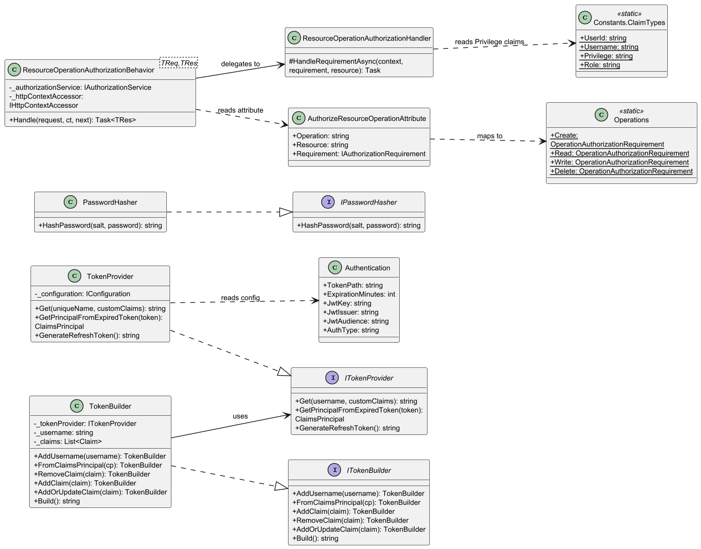
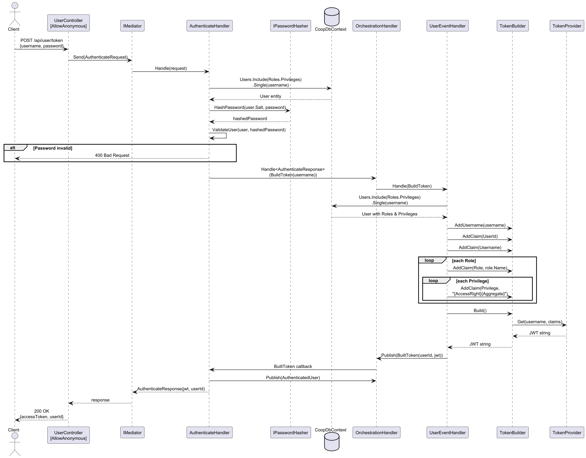
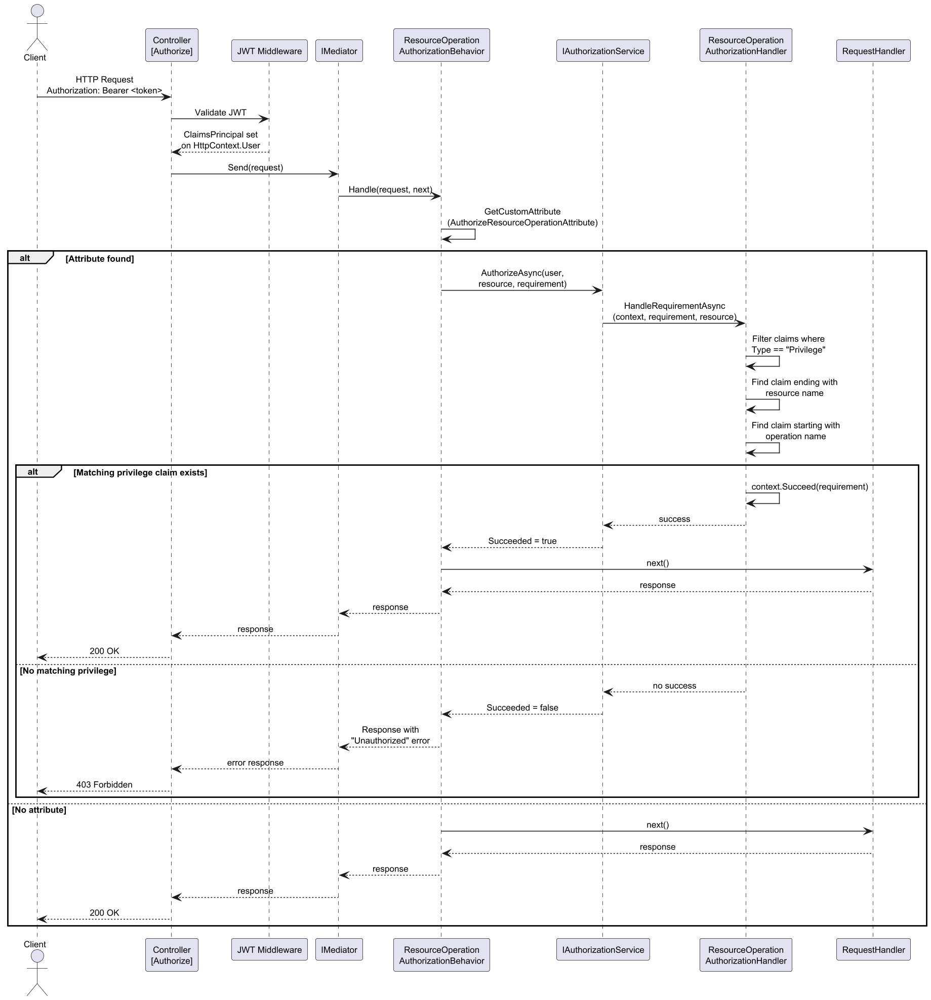
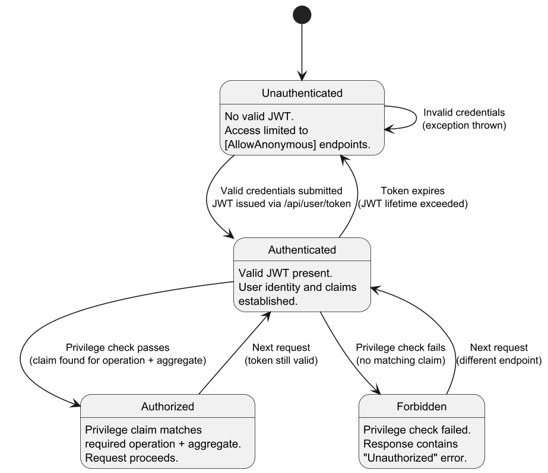
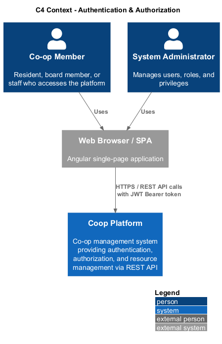
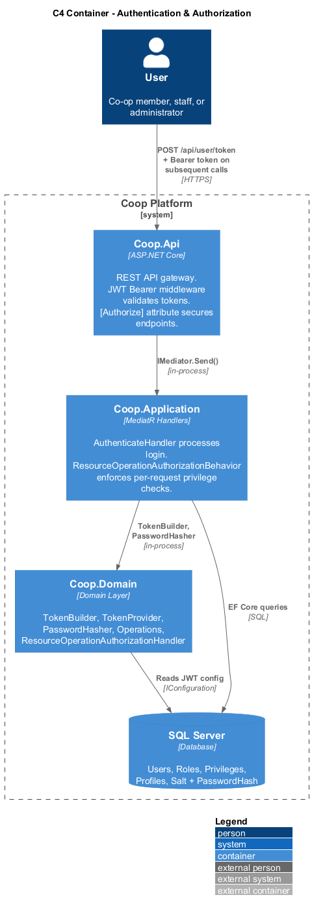
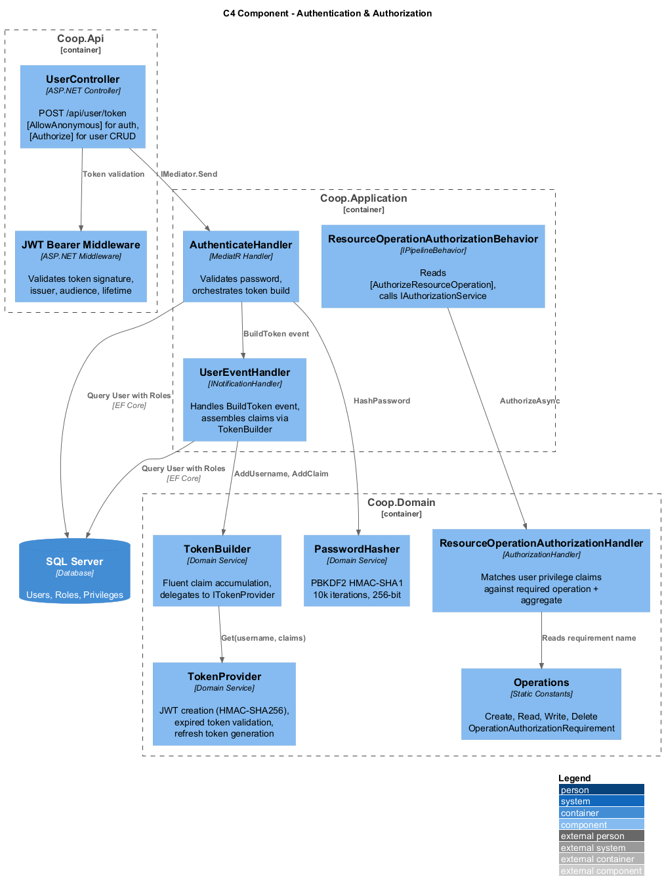

# 02 - Authentication and Authorization

## Overview

The Coop platform implements a JWT-based authentication and claims-based authorization system. Users authenticate by submitting credentials to the `/api/user/token` endpoint. Upon successful password validation, the system constructs a JWT containing the user's identity, roles, and fine-grained privilege claims. Subsequent API requests carry this token in the `Authorization` header. Protected endpoints are secured by the `[Authorize]` attribute, and individual operations are guarded by a resource-based authorization pipeline that checks the caller's privilege claims against the required operation and aggregate.

The documented implementation baseline for this feature is ASP.NET Core on **.NET 10 LTS**, with **Angular 21** clients consuming the authenticated API surface.

### Key Design Decisions

- **HMAC-SHA256 signed JWTs** for stateless authentication; token expiration is configurable via `Authentication:ExpirationMinutes`.
- **PBKDF2 password hashing** with per-user random salt (128-bit) and HMAC-SHA1 PRF (10,000 iterations).
- **Claims-based privilege model**: each privilege is encoded as `{AccessRight}{Aggregate}` (e.g., `ReadMaintenanceRequest`, `WriteNotice`) and embedded directly in the JWT.
- **MediatR pipeline behavior** (`ResourceOperationAuthorizationBehavior`) intercepts commands/queries decorated with `[AuthorizeResourceOperation]` and delegates to ASP.NET Core's `IAuthorizationService`.
- **Orchestration-driven token building**: the `AuthenticateHandler` publishes a `BuildToken` domain event, and the `UserEventHandler` assembles claims via `TokenBuilder` before publishing `BuiltToken` back.

## Components

### TokenBuilder / ITokenBuilder

**Namespace:** `Coop.Domain`

A fluent builder that accumulates claims and delegates JWT generation to `ITokenProvider`. Supports hydrating from an existing `ClaimsPrincipal` for token refresh scenarios.

| Member | Description |
|---|---|
| `AddUsername(string)` | Sets the subject / unique name for the token |
| `FromClaimsPrincipal(ClaimsPrincipal)` | Imports username and claims from an existing principal |
| `AddClaim(Claim)` | Appends a claim |
| `RemoveClaim(Claim)` | Removes a claim by type |
| `AddOrUpdateClaim(Claim)` | Upserts a claim (remove-then-add) |
| `Build()` | Calls `ITokenProvider.Get()` and returns the serialized JWT string |

### TokenProvider : ITokenProvider

**Namespace:** `Coop.Domain`

Generates and validates JWTs using `System.IdentityModel.Tokens.Jwt`. Reads issuer, audience, key, and expiration from `IConfiguration`.

| Method | Description |
|---|---|
| `Get(string, IEnumerable<Claim>)` | Creates and signs a new JWT |
| `GetPrincipalFromExpiredToken(string)` | Validates signature (ignoring lifetime) and returns a `ClaimsPrincipal` |
| `GenerateRefreshToken()` | Returns a cryptographically random Base64 string |

### PasswordHasher : IPasswordHasher

**Namespace:** `Coop.Domain`

Hashes passwords using PBKDF2 with HMAC-SHA1 (10,000 iterations, 256-bit output). Each `User` entity stores its own 128-bit random salt.

### ResourceOperationAuthorizationHandler

**Namespace:** `Coop.Domain`

Extends `AuthorizationHandler<OperationAuthorizationRequirement, object>`. For a given resource name (aggregate), it scans the user's `Privilege` claims for one whose value starts with the required operation name and ends with the resource name.

### ResourceOperationAuthorizationBehavior\<TRequest, TResponse\>

**Namespace:** `Coop.Domain`

A MediatR `IPipelineBehavior` that inspects the request type for the `[AuthorizeResourceOperation]` attribute. If present, it invokes `IAuthorizationService.AuthorizeAsync` with the attribute's `Requirement` and `Resource`. On failure, it short-circuits the pipeline and returns an error response.

### AuthorizeResourceOperationAttribute

**Namespace:** `Coop.Domain`

Applied to MediatR request classes to declare the required operation (`Create`, `Read`, `Write`, `Delete`) and target aggregate. Exposes an `IAuthorizationRequirement` via a switch expression over `Operations`.

### Operations

**Namespace:** `Coop.Domain`

Static class exposing four `OperationAuthorizationRequirement` constants: `Create`, `Read`, `Write`, `Delete`.

### Constants.ClaimTypes

**Namespace:** `Coop.Domain`

| Constant | Value |
|---|---|
| `UserId` | `"UserId"` |
| `Username` | `"http://schemas.xmlsoap.org/ws/2005/05/identity/claims/name"` |
| `Privilege` | `"Privilege"` |
| `Role` | `"http://schemas.microsoft.com/ws/2008/06/identity/claims/role"` |

### Authentication (Configuration POCO)

**Namespace:** `Coop.Domain`

Binds to the `Authentication` configuration section: `JwtKey`, `JwtIssuer`, `JwtAudience`, `ExpirationMinutes`, `TokenPath`, `AuthType`.

## Diagrams

### Class Diagram

### JWT Authentication Sequence

### Resource Authorization Sequence

### Authentication State Machine

### C4 Context

### C4 Container

### C4 Component

