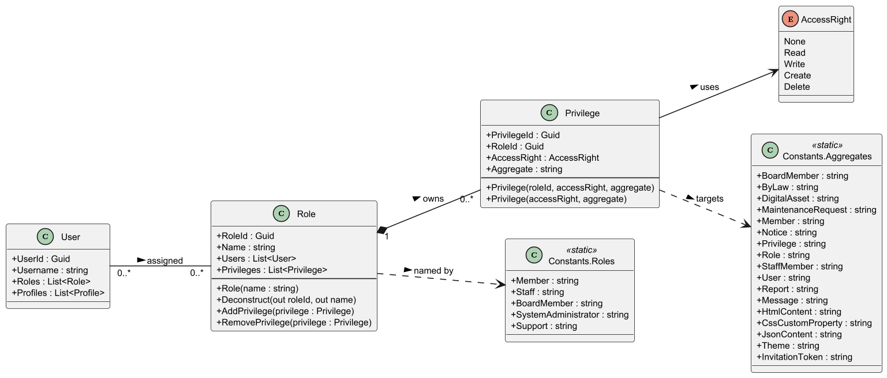
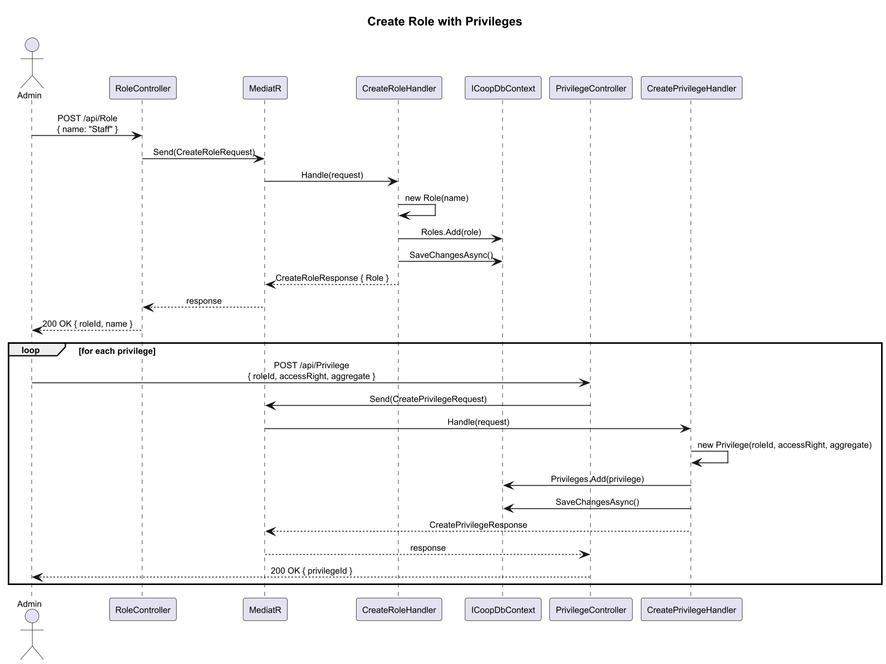
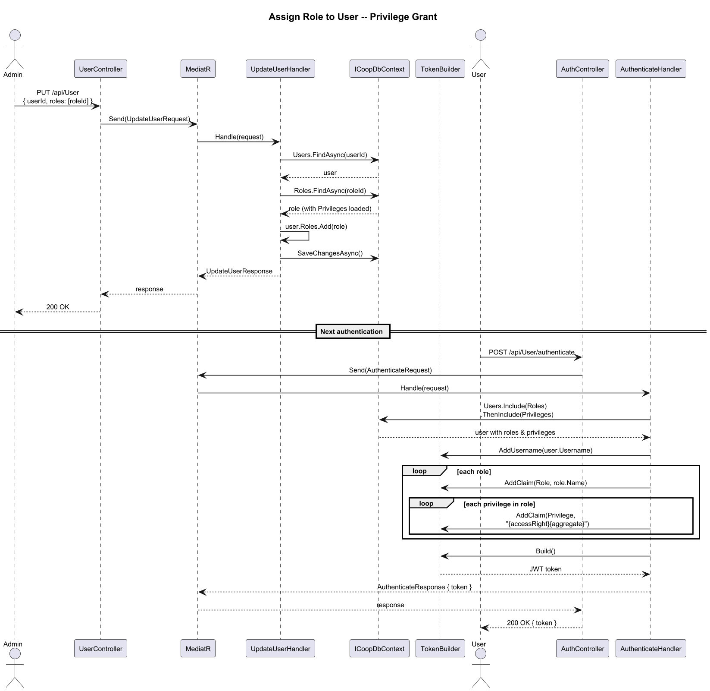
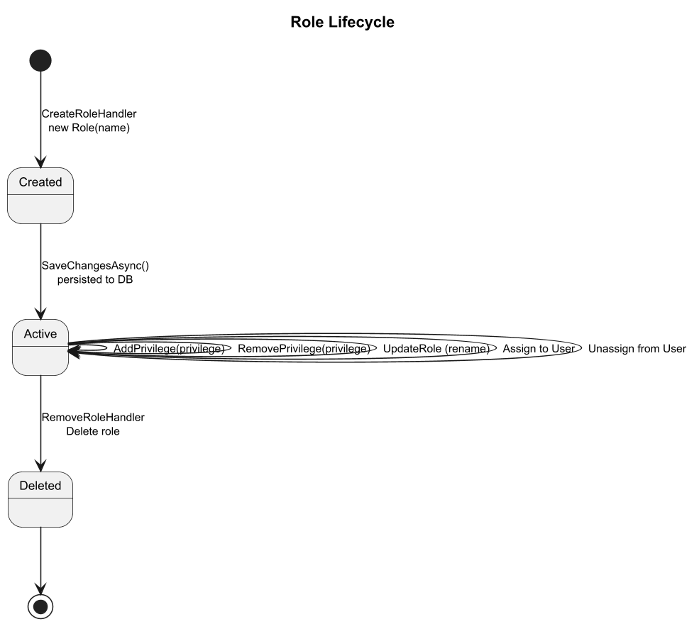
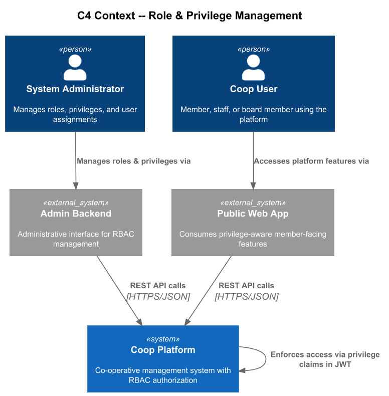
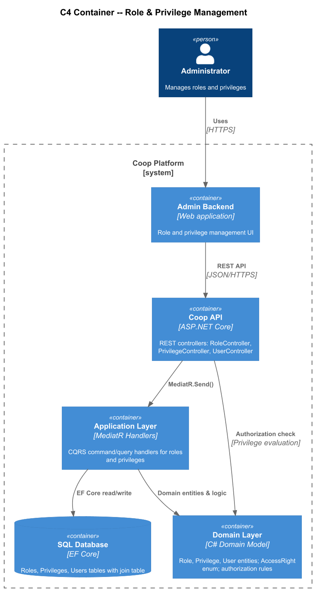
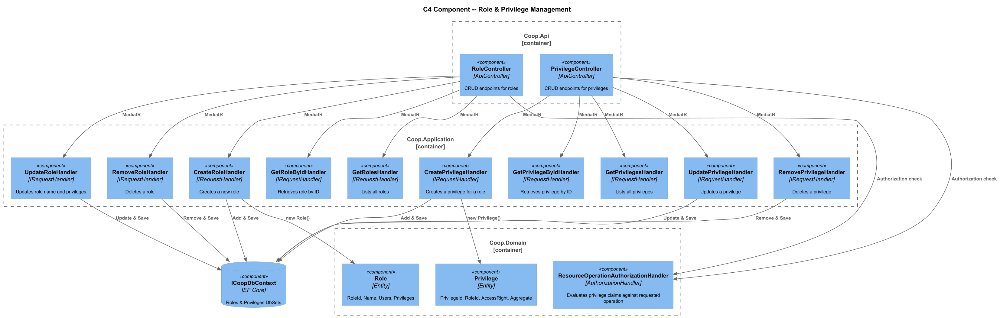

# 03 - Role and Privilege Management: Detailed Design

## 1. Overview

The Role and Privilege Management feature provides the authorization backbone for the Coop platform. It implements a role-based access control (RBAC) model in which **Roles** are assigned to **Users** (many-to-many) and each Role owns a collection of **Privileges** (one-to-many). A Privilege pairs an `AccessRight` enum value with the name of a domain aggregate, allowing fine-grained control over which operations a user may perform on each resource.

At authentication time, a user's privileges are serialized as JWT claims (`Constants.ClaimTypes.Privilege`). The `ResourceOperationAuthorizationHandler` evaluates these claims at runtime, matching the requested operation and aggregate name against the privilege claims present in the `ClaimsPrincipal`.

### Key design goals

- Centralized, auditable definition of access policies through named roles.
- Predefined roles (`Member`, `Staff`, `BoardMember`, `SystemAdministrator`, `Support`) seeded via `Constants.Roles`.
- Dynamic privilege assignment per aggregate, supporting the full set of access rights (`None`, `Read`, `Write`, `Create`, `Delete`).
- Clean CQRS/Mediator separation between API controllers and domain logic.

---

## 2. Domain Model

### 2.1 Role Entity

| Property | Type | Description |
|---|---|---|
| RoleId | `Guid` | Primary key (database-generated). |
| Name | `string` | Unique role name (e.g., "SystemAdministrator"). |
| Users | `List<User>` | Navigation -- users assigned this role. |
| Privileges | `List<Privilege>` | Navigation -- privileges granted by this role. |

Methods: `Deconstruct(out Guid roleId, out string name)`, `AddPrivilege(Privilege)`, `RemovePrivilege(Privilege)`.

### 2.2 Privilege Entity

| Property | Type | Description |
|---|---|---|
| PrivilegeId | `Guid` | Primary key. |
| RoleId | `Guid` | Foreign key to the owning Role. |
| AccessRight | `AccessRight` | The granted operation type. |
| Aggregate | `string` | The target aggregate name (matches `Constants.Aggregates`). |

### 2.3 AccessRight Enum

`None` | `Read` | `Write` | `Create` | `Delete`

### 2.4 Constants

- **Constants.Roles** -- `Member`, `Staff`, `BoardMember`, `SystemAdministrator`, `Support`.
- **Constants.Aggregates** -- `BoardMember`, `ByLaw`, `DigitalAsset`, `MaintenanceRequest`, `Member`, `Notice`, `Privilege`, `Role`, `StaffMember`, `User`, `Report`, `Message`, `HtmlContent`, `CssCustomProperty`, `JsonContent`, `Theme`, `InvitationToken`.
- **Constants.AccessRights** -- convenience lists: `Read`, `ReadWrite`, `FullAccess`.

---

## 3. Class Diagram

---

## 4. Sequence Diagrams

### 4.1 Create Role with Privileges

### 4.2 Assign Role to User (Privilege Grant)

---

## 5. State Diagram -- Role Lifecycle

---

## 6. C4 Architecture Diagrams

### 6.1 Context

### 6.2 Container

### 6.3 Component

---

## 7. API Surface

### RoleController (`/api/Role`)

| Verb | Route | Handler | Description |
|---|---|---|---|
| GET | `/{roleId}` | `GetRoleByIdHandler` | Retrieve a single role by ID. |
| GET | `/` | `GetRolesHandler` | List all roles. |
| GET | `/page/{pageSize}/{index}` | `GetRolesPageHandler` | Paginated role listing. |
| POST | `/` | `CreateRoleHandler` | Create a new role. |
| PUT | `/` | `UpdateRoleHandler` | Update an existing role (name, privileges). |
| DELETE | `/{roleId}` | `RemoveRoleHandler` | Delete a role. |

### PrivilegeController (`/api/Privilege`)

| Verb | Route | Handler | Description |
|---|---|---|---|
| GET | `/{privilegeId}` | `GetPrivilegeByIdHandler` | Retrieve a single privilege. |
| GET | `/` | `GetPrivilegesHandler` | List all privileges. |
| GET | `/page/{pageSize}/{index}` | `GetPrivilegesPageHandler` | Paginated privilege listing. |
| POST | `/` | `CreatePrivilegeHandler` | Create a new privilege for a role. |
| PUT | `/` | `UpdatePrivilegeHandler` | Update an existing privilege. |
| DELETE | `/{privilegeId}` | `RemovePrivilegeHandler` | Delete a privilege. |

---

## 8. Authorization Flow

1. User authenticates -- `TokenBuilder` encodes role and privilege claims into a JWT.
2. On each API request, the `[AuthorizeResourceOperation]` attribute triggers `ResourceOperationAuthorizationHandler`.
3. The handler inspects `Constants.ClaimTypes.Privilege` claims, matching `{AccessRight}{Aggregate}` against the requested operation and resource.
4. Access is granted (`context.Succeed`) only when a matching claim exists.

---

## 9. Data Storage

Roles and Privileges are persisted via Entity Framework Core through `ICoopDbContext.Roles` and `ICoopDbContext.Privileges`. The User-Role relationship is a many-to-many join managed by EF Core's navigation properties (`User.Roles`, `Role.Users`).

---

## 10. Documentation Note

Implementation source paths have been intentionally omitted from this design because this repository now stores requirements and design artifacts only.
