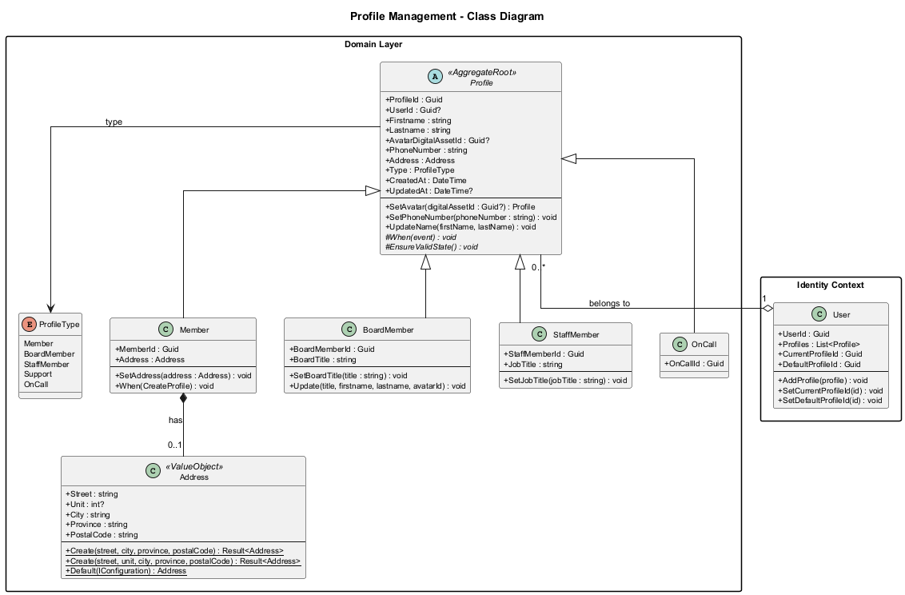
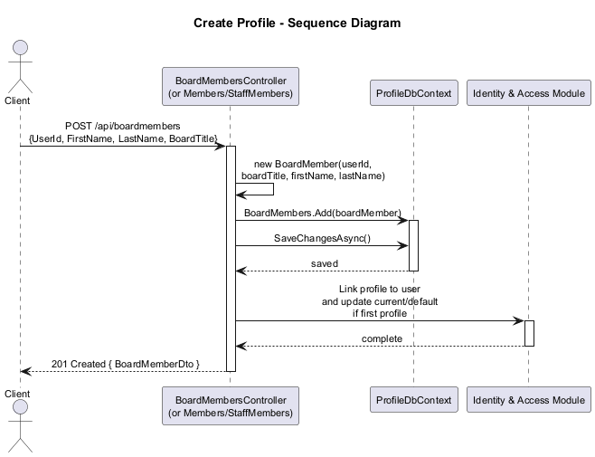
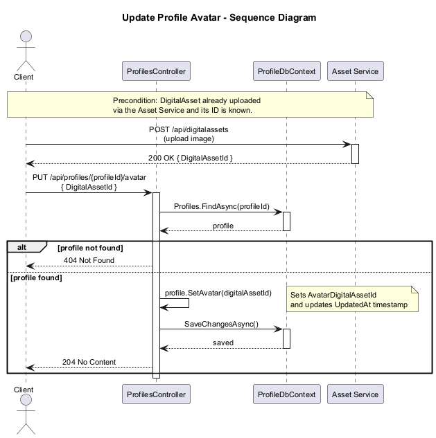
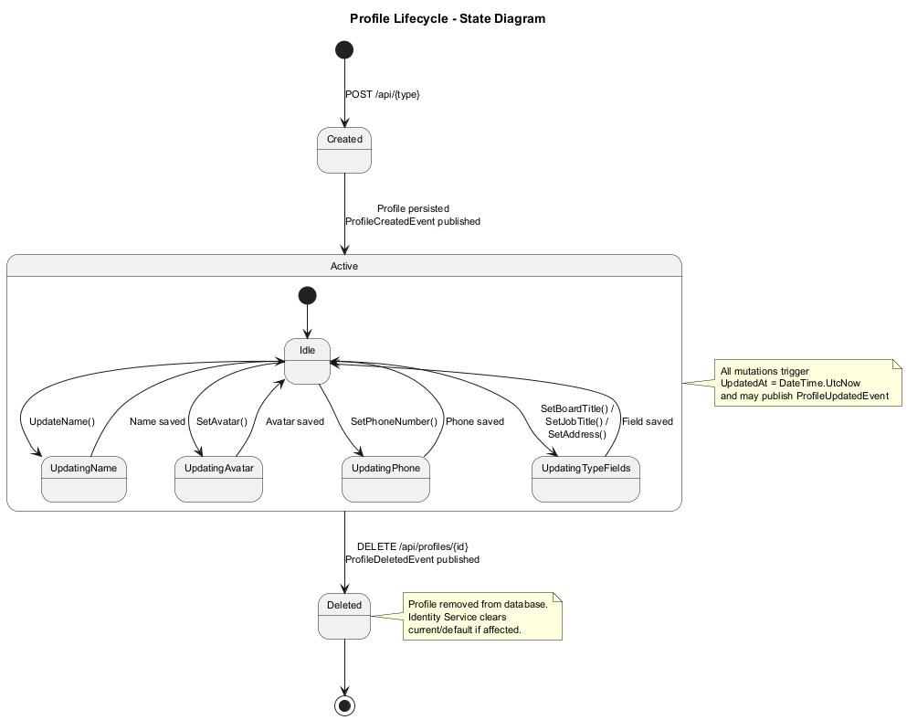
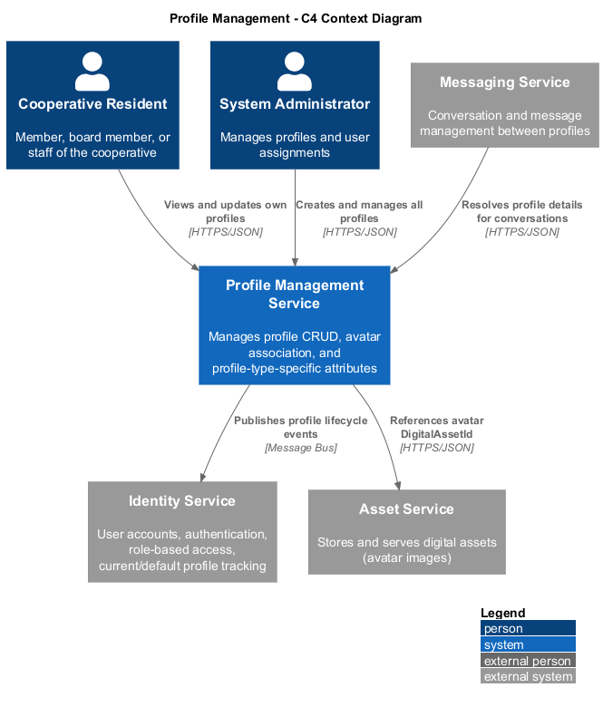
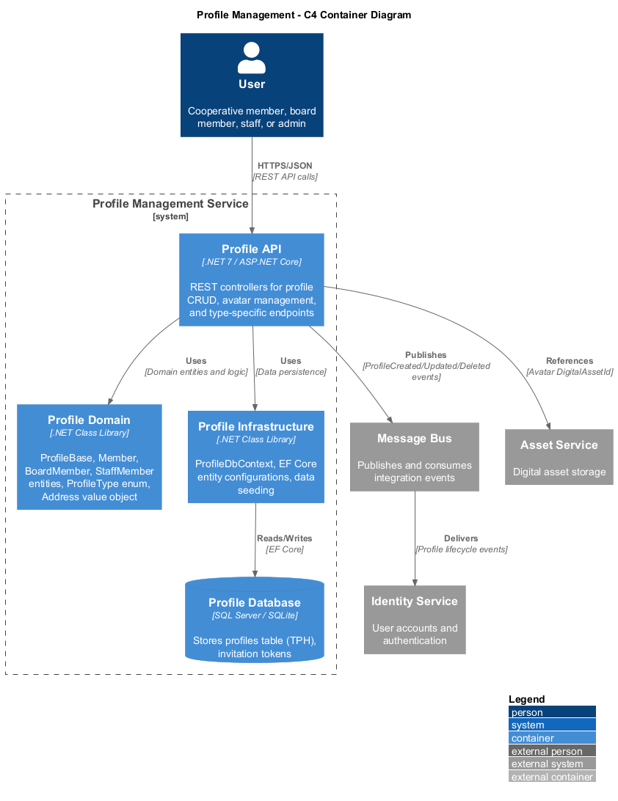
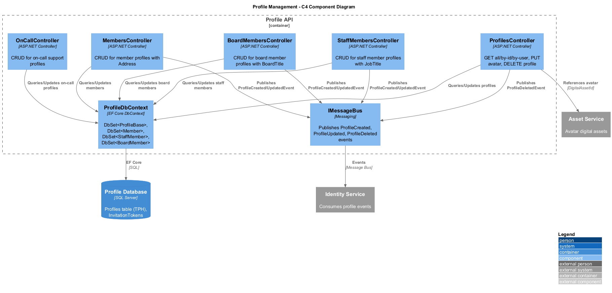

# 04 - Profile Management: Detailed Design

## Overview

The Profile Management feature enables the Coop platform to support multiple profile types per user, each representing a distinct operational role within the cooperative. A single user may hold profiles such as Member, BoardMember, StaffMember, or OnCall, and can switch between them at runtime via the current/default profile mechanism.

The domain model uses a Table-Per-Hierarchy (TPH) inheritance strategy with `ProfileBase` as the abstract base class. Each concrete subtype (Member, BoardMember, StaffMember) extends the base with role-specific attributes (e.g., BoardTitle, JobTitle, Address). The Profile microservice exposes dedicated REST controllers per profile type and publishes integration events (ProfileCreatedEvent, ProfileUpdatedEvent, ProfileDeletedEvent) via the message bus to synchronize state with the Identity service and other consumers.

## Requirements Traceability

This design satisfies **L1-REQ-004**: "The system shall support multiple profile types (Member, BoardMember, StaffMember, OnCall) per user, allowing users to operate under different contexts with a current and default profile selection."

## Domain Model

The class diagram below illustrates the inheritance hierarchy, value objects, and relationships between Profile entities and the User aggregate.

### Key Entities

| Entity | Responsibility |
|---|---|
| **ProfileBase** | Abstract base class holding shared profile attributes: identity, name, phone, avatar reference, timestamps, and the discriminator ProfileType. |
| **Member** | Cooperative resident profile. Extends ProfileBase with an optional Address value object for unit/building location. |
| **BoardMember** | Board of directors profile. Extends ProfileBase with a BoardTitle indicating the member's board role (e.g., President, Treasurer). |
| **StaffMember** | Cooperative employee profile. Extends ProfileBase with a JobTitle field. |
| **OnCall** | On-call support profile. Minimal extension of Profile from the legacy domain layer; used for after-hours emergency contacts. |
| **Address** | Value object representing a physical address (Street, Unit, City, Province, PostalCode). Used as an owned entity by Member. |
| **ProfileType** | Enumeration discriminator: Member, BoardMember, Staff, Support, OnCall. |

### Value Objects

**Address** is modeled as an owned entity type in EF Core. In the legacy domain layer it extends `CSharpFunctionalExtensions.ValueObject` with factory methods (`Create`) that return `Result<Address>`. In the microservice domain it is a simple POCO. Both representations carry the same five fields: Street, Unit, City, Province, and PostalCode.

## Behavioral Flows

### Create Profile

When a new profile is created through a type-specific controller (e.g., `BoardMembersController.Create`), the system instantiates the concrete subtype, persists it, and publishes a `ProfileCreatedEvent` so that the Identity service can associate the profile with the user and set current/default profile if it is the user's first profile.

### Update Avatar

Avatar updates are handled through the generic `ProfilesController.SetAvatar` endpoint. The profile's `AvatarDigitalAssetId` is updated to reference a previously uploaded DigitalAsset.

### Profile Lifecycle

A profile transitions through Created, Active, and Deleted states. Most mutations (name, avatar, type-specific fields) occur within the Active state.

## Architecture Views

### C4 Context

The context diagram shows the Profile Management service boundary and its interactions with external actors and adjacent systems.

### C4 Container

The container diagram decomposes the Profile bounded context into its deployable units: the Profile API, Domain library, Infrastructure layer, and backing data store.

### C4 Component

The component diagram details the internal structure of the Profile API container, showing controllers, the database context, and the message bus integration.

## API Endpoints

| Method | Route | Description |
|---|---|---|
| GET | `/api/profiles` | List all profiles |
| GET | `/api/profiles/{id}` | Get profile by ID |
| GET | `/api/profiles/by-user/{userId}` | Get profiles for a user |
| PUT | `/api/profiles/{id}/avatar` | Set profile avatar |
| DELETE | `/api/profiles/{id}` | Delete a profile |
| GET | `/api/boardmembers` | List board members |
| GET | `/api/boardmembers/{id}` | Get board member by ID |
| POST | `/api/boardmembers` | Create board member |
| PUT | `/api/boardmembers/{id}` | Update board member |
| GET | `/api/members` | List members |
| GET | `/api/members/{id}` | Get member by ID |
| POST | `/api/members` | Create member |
| PUT | `/api/members/{id}` | Update member |
| GET | `/api/staffmembers` | List staff members |
| GET | `/api/staffmembers/{id}` | Get staff member by ID |
| POST | `/api/staffmembers` | Create staff member |
| PUT | `/api/staffmembers/{id}` | Update staff member |

## Integration Events

| Event | Published When | Consumers |
|---|---|---|
| `ProfileCreatedEvent` | A new profile is persisted | Identity Service (associates profile with user, sets default/current) |
| `ProfileUpdatedEvent` | Profile name or attributes change | Identity Service, Messaging Service |
| `ProfileDeletedEvent` | A profile is removed | Identity Service (clears current/default if affected) |

## Data Storage

The Profile microservice uses its own dedicated database (`ProfileDb`) with EF Core. The `ProfileDbContext` exposes `DbSet<ProfileBase>`, `DbSet<Member>`, `DbSet<StaffMember>`, `DbSet<BoardMember>`, and `DbSet<InvitationToken>`. TPH inheritance maps all profile subtypes to a single `Profiles` table with a discriminator column.

## Security

All profile endpoints require JWT authentication (`[Authorize]`). Write operations are further constrained by the caller's role privileges as defined in the Role and Privilege Management feature.
