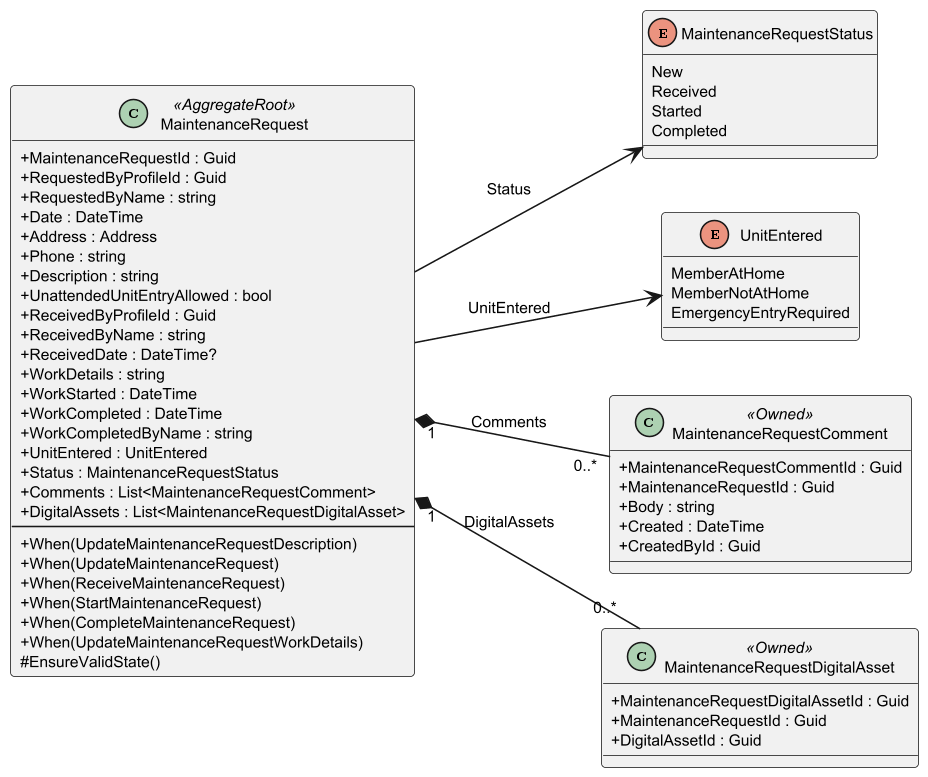
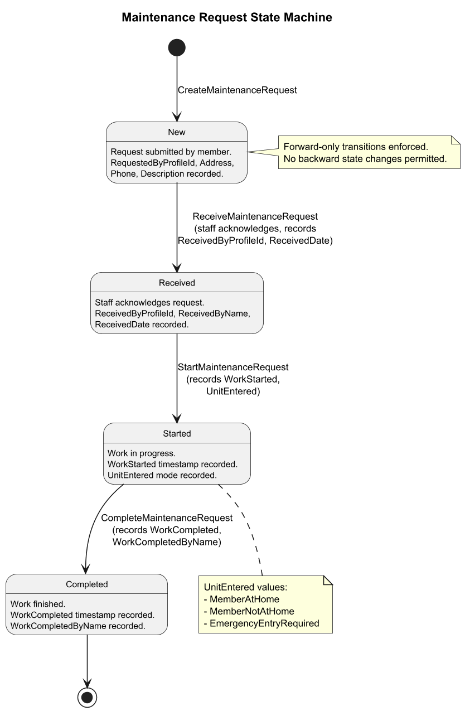
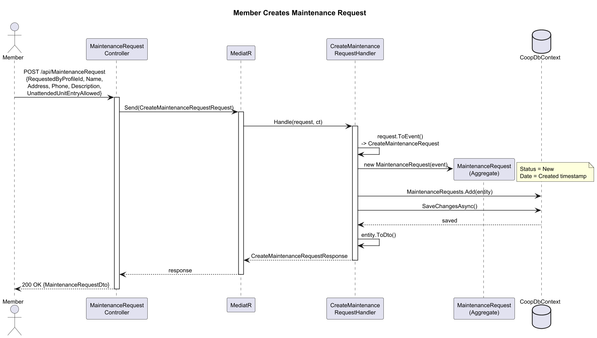
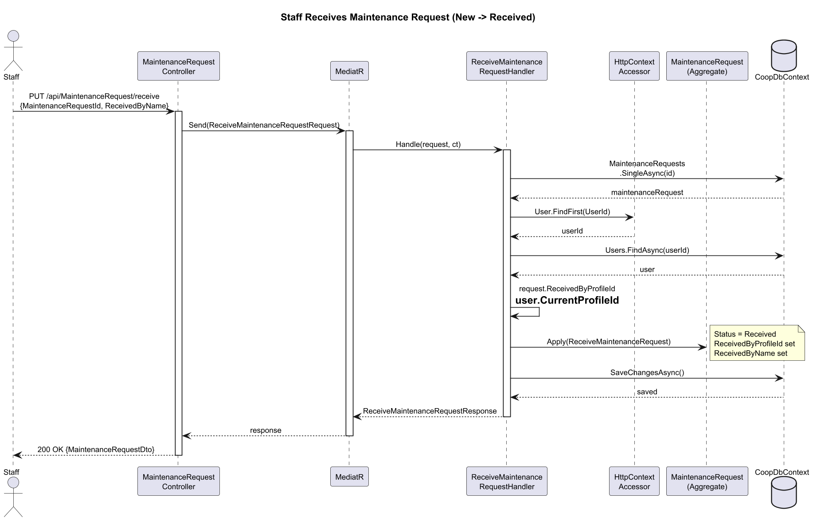
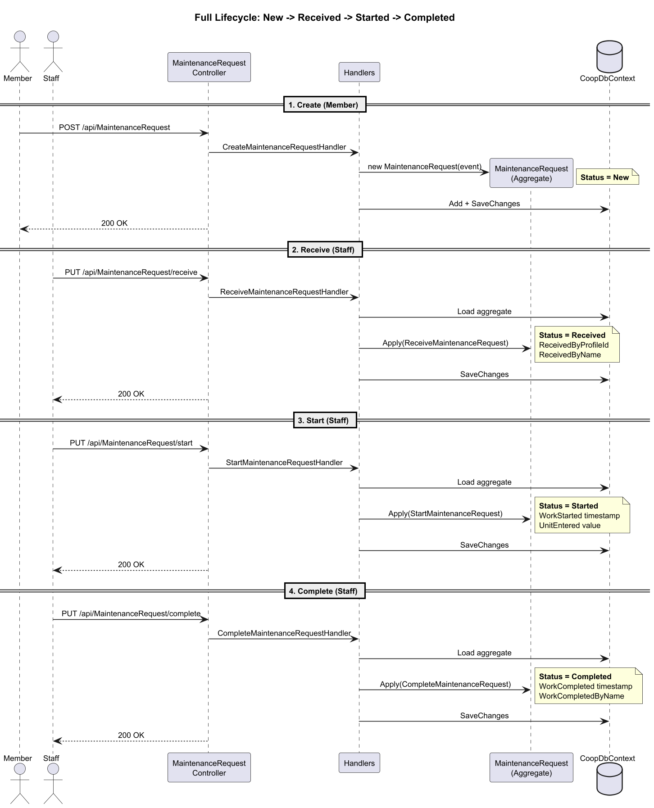
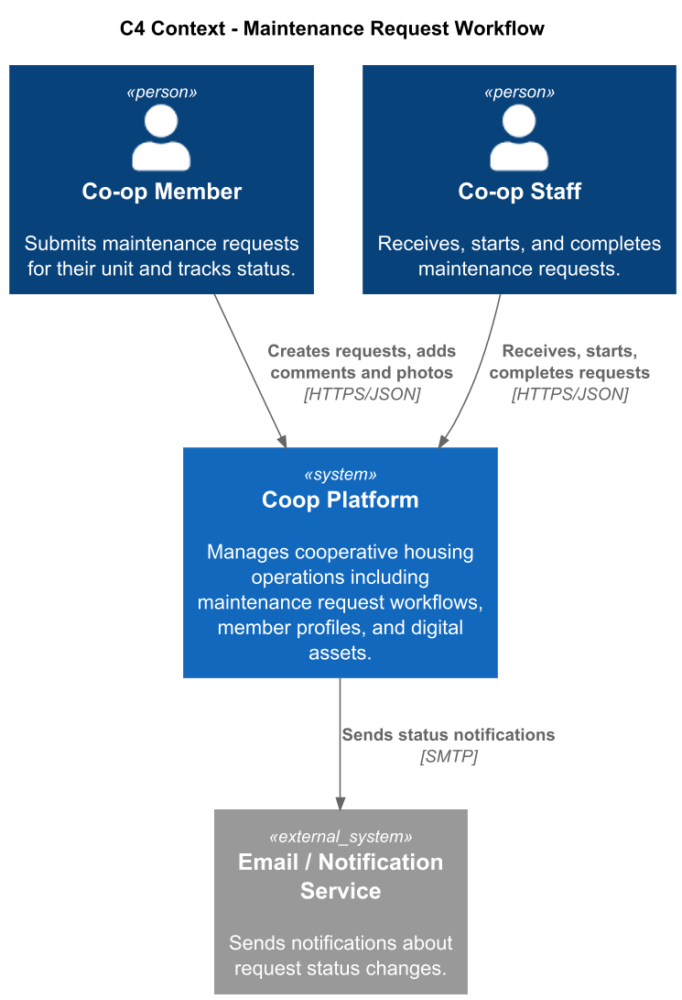
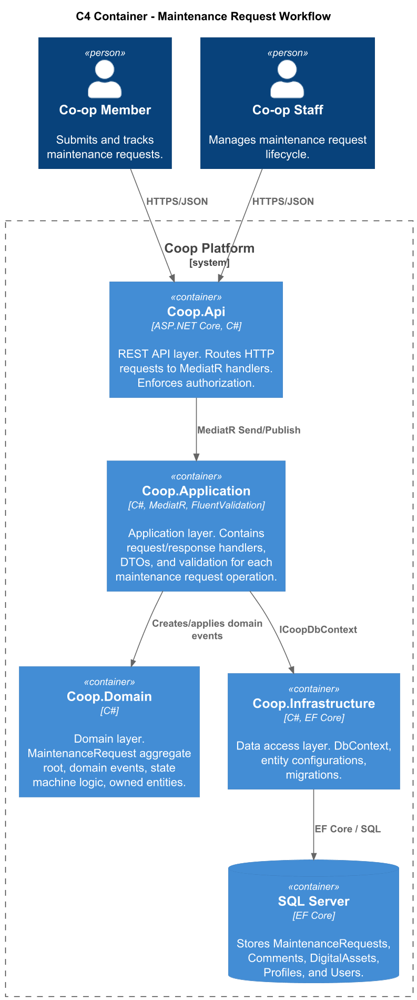
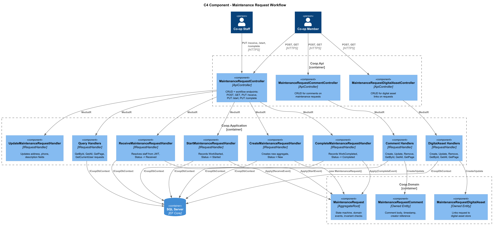

# 05 - Maintenance Request Workflow

## Overview

The Maintenance Request Workflow feature enables cooperative housing members to submit maintenance requests for their units and allows staff to manage those requests through a structured lifecycle. Each request progresses through four forward-only states: **New**, **Received**, **Started**, and **Completed**. The workflow captures who requested work, who acknowledged it, when work began, and when it finished, providing a full audit trail.

The domain is built around the `MaintenanceRequest` aggregate root, which owns `MaintenanceRequestComment` and `MaintenanceRequestDigitalAsset` value objects. The system follows a CQRS pattern using MediatR, with dedicated request/handler pairs for each operation, and domain events that drive state transitions on the aggregate.

## Domain Model

The class diagram below shows the `MaintenanceRequest` aggregate root, its owned entities, and the two enumerations that constrain status transitions and unit-entry tracking.

### MaintenanceRequest (AggregateRoot)

The central entity that tracks the full lifecycle of a maintenance request.

| Property | Type | Description |
|---|---|---|
| MaintenanceRequestId | Guid | Primary key |
| RequestedByProfileId | Guid | FK to the member profile that created the request |
| RequestedByName | string | Display name of the requesting member |
| Date | DateTime | Date the request was created |
| Address | Address | Unit address value object (Street, Unit, City, Province, PostalCode) |
| Phone | string | Contact phone number |
| Description | string | Free-text description of the maintenance issue |
| UnattendedUnitEntryAllowed | bool | Whether staff may enter the unit without the member present |
| ReceivedByProfileId | Guid | FK to the staff profile that acknowledged the request |
| ReceivedByName | string | Display name of the receiving staff member |
| ReceivedDate | DateTime? | Timestamp when the request was acknowledged |
| WorkDetails | string | Notes about the work performed |
| WorkStarted | DateTime | Timestamp when work began |
| WorkCompleted | DateTime | Timestamp when work finished |
| WorkCompletedByName | string | Name of the person who completed the work |
| UnitEntered | UnitEntered | How the unit was accessed during work |
| Status | MaintenanceRequestStatus | Current lifecycle state (New, Received, Started, Completed) |
| Comments | List of MaintenanceRequestComment | Discussion thread on the request |
| DigitalAssets | List of MaintenanceRequestDigitalAsset | Photos or documents attached to the request |

**Methods:**

- `When(UpdateDescription)` -- Updates the description text.
- `When(Update)` -- Updates address, phone, description, and unattended-entry flag.
- `When(Receive)` -- Transitions status to Received; records who acknowledged it.
- `When(Start)` -- Transitions status to Started; records work start time and unit-entry mode.
- `When(Complete)` -- Transitions status to Completed; records completion time and who completed it.
- `When(UpdateWorkDetails)` -- Updates the work details notes.
- `EnsureValidState()` -- Validates aggregate invariants.

### MaintenanceRequestComment (Owned Entity)

| Property | Type | Description |
|---|---|---|
| MaintenanceRequestCommentId | Guid | Primary key |
| MaintenanceRequestId | Guid | FK to parent request |
| Body | string | Comment text |
| Created | DateTime | Timestamp (defaults to UTC now) |
| CreatedById | Guid | Profile ID of the commenter |

### MaintenanceRequestDigitalAsset (Owned Entity)

| Property | Type | Description |
|---|---|---|
| MaintenanceRequestDigitalAssetId | Guid | Primary key |
| MaintenanceRequestId | Guid | FK to parent request |
| DigitalAssetId | Guid | FK to the shared DigitalAsset store |

### MaintenanceRequestStatus (Enum)

`New` | `Received` | `Started` | `Completed`

### UnitEntered (Enum)

`MemberAtHome` | `MemberNotAtHome` | `EmergencyEntryRequired`

## State Machine

The maintenance request follows a strict forward-only state machine. No backward transitions are permitted.

| Transition | Trigger Command | Data Recorded |
|---|---|---|
| [*] to New | CreateMaintenanceRequest | RequestedByProfileId, RequestedByName, Address, Phone, Description |
| New to Received | ReceiveMaintenanceRequest | ReceivedByProfileId, ReceivedByName, ReceivedDate |
| Received to Started | StartMaintenanceRequest | WorkStarted, UnitEntered |
| Started to Completed | CompleteMaintenanceRequest | WorkCompleted, WorkCompletedByName |

## Sequence Diagrams

### Creating a Maintenance Request

A member submits a new maintenance request through the API. The handler creates the aggregate, persists it, and returns the DTO.

### Receiving a Maintenance Request

Staff acknowledges a request, transitioning it from New to Received. The handler resolves the current user from the HTTP context to populate `ReceivedByProfileId`.

### Complete Workflow Lifecycle

The full lifecycle from creation through completion, showing all four state transitions and the actors involved at each step.

## C4 Architecture Diagrams

### Context Diagram

Shows the Coop platform and its external actors: Members who submit requests and Staff who manage them.

### Container Diagram

Shows the API, Application, Domain, and Infrastructure layers that compose the maintenance request feature.

### Component Diagram

Shows the internal components of the API and Application layers: controllers, MediatR handlers, the domain aggregate, and the database context.

## API Endpoints

### MaintenanceRequestController (`/api/MaintenanceRequest`)

| Method | Route | Handler | Description |
|---|---|---|---|
| POST | `/` | CreateMaintenanceRequestHandler | Create a new request |
| GET | `/{id}` | GetMaintenanceRequestByIdHandler | Get request by ID |
| GET | `/my` | GetCurrentUserMaintenanceRequestsHandler | Get requests for current user |
| GET | `/` | GetMaintenanceRequestsHandler | Get all requests |
| GET | `/page/{pageSize}/{index}` | GetMaintenanceRequestsPageHandler | Paginated listing |
| PUT | `/` | UpdateMaintenanceRequestHandler | Update request details |
| PUT | `/description` | UpdateMaintenanceRequestDescriptionHandler | Update description only |
| PUT | `/work-details` | UpdateMaintenanceRequestWorkDetailsHandler | Update work details |
| PUT | `/receive` | ReceiveMaintenanceRequestHandler | Acknowledge request (New to Received) |
| PUT | `/start` | StartMaintenanceRequestHandler | Start work (Received to Started) |
| PUT | `/complete` | CompleteMaintenanceRequestHandler | Complete work (Started to Completed) |
| DELETE | `/{id}` | RemoveMaintenanceRequestHandler | Delete a request |

### MaintenanceRequestCommentController (`/api/MaintenanceRequestComment`)

| Method | Route | Handler | Description |
|---|---|---|---|
| POST | `/` | CreateMaintenanceRequestCommentHandler | Add a comment |
| GET | `/{id}` | GetMaintenanceRequestCommentByIdHandler | Get comment by ID |
| GET | `/` | GetMaintenanceRequestCommentsHandler | Get all comments |
| GET | `/page/{pageSize}/{index}` | GetMaintenanceRequestCommentsPageHandler | Paginated listing |
| PUT | `/` | UpdateMaintenanceRequestCommentHandler | Update a comment |
| DELETE | `/{id}` | RemoveMaintenanceRequestCommentHandler | Delete a comment |

### MaintenanceRequestDigitalAssetController (`/api/MaintenanceRequestDigitalAsset`)

| Method | Route | Handler | Description |
|---|---|---|---|
| POST | `/` | CreateMaintenanceRequestDigitalAssetHandler | Attach a digital asset |
| GET | `/{id}` | GetMaintenanceRequestDigitalAssetByIdHandler | Get asset link by ID |
| GET | `/` | GetMaintenanceRequestDigitalAssetsHandler | Get all asset links |
| GET | `/page/{pageSize}/{index}` | GetMaintenanceRequestDigitalAssetsPageHandler | Paginated listing |
| PUT | `/` | UpdateMaintenanceRequestDigitalAssetHandler | Update an asset link |
| DELETE | `/{id}` | RemoveMaintenanceRequestDigitalAssetHandler | Delete an asset link |

## Key Design Decisions

1. **Forward-only state machine** -- Status transitions are strictly ordered (New to Received to Started to Completed). The aggregate enforces this through the `When` method overloads that set status explicitly on each transition.

2. **Domain events as commands** -- The system uses domain event classes (`CreateMaintenanceRequest`, `ReceiveMaintenanceRequest`, etc.) as the payload for `When` methods on the aggregate. MediatR request classes inherit from these domain events, keeping the API contract aligned with domain logic.

3. **Owned entities for Comments and DigitalAssets** -- Both `MaintenanceRequestComment` and `MaintenanceRequestDigitalAsset` are EF Core `[Owned]` types, ensuring they are always loaded and persisted with their parent aggregate.

4. **HTTP context for staff identity** -- The `ReceiveMaintenanceRequestHandler` extracts the current user's profile ID from the JWT claims via `IHttpContextAccessor`, so the staff member acknowledging a request is automatically recorded without relying on client-supplied data.

5. **CQRS with MediatR** -- Each operation has a dedicated Request/Response/Handler triplet, providing clear separation of concerns and enabling independent validation via FluentValidation.
