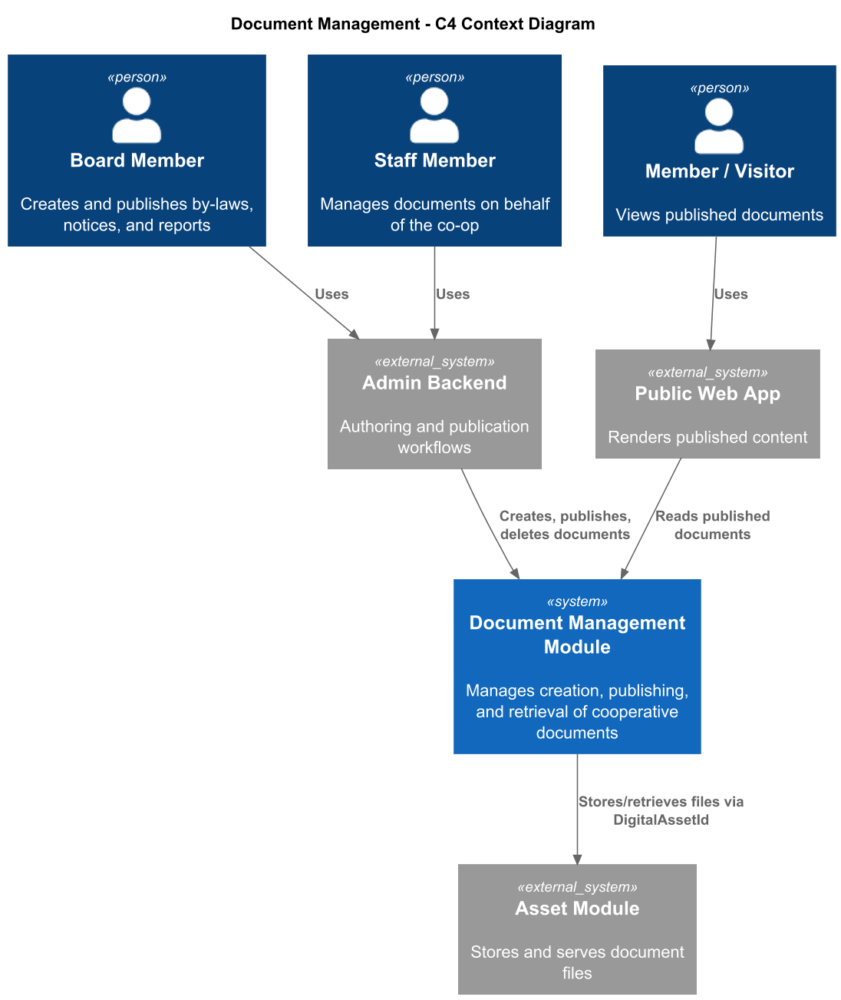
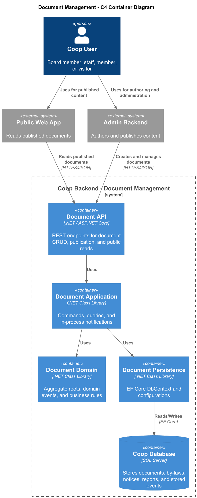
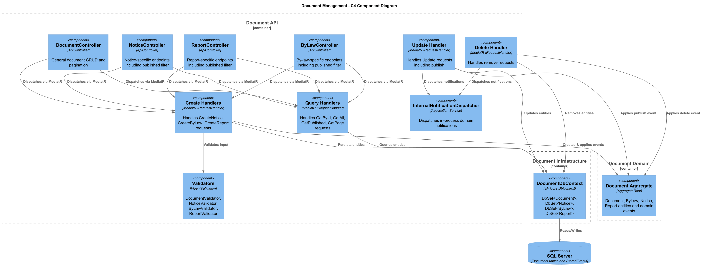
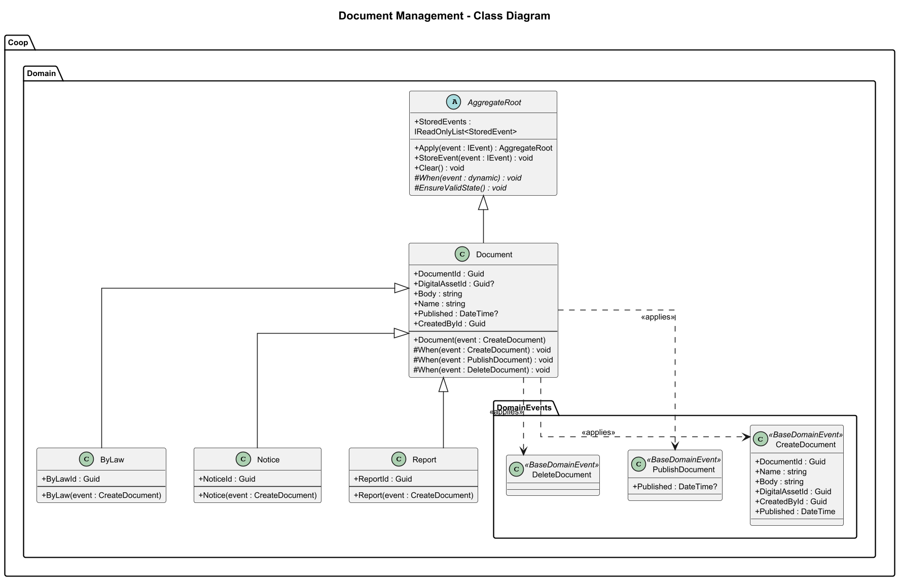
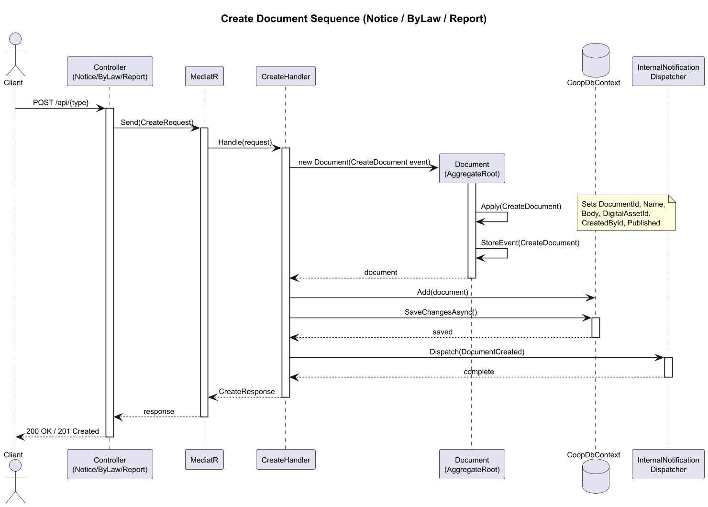
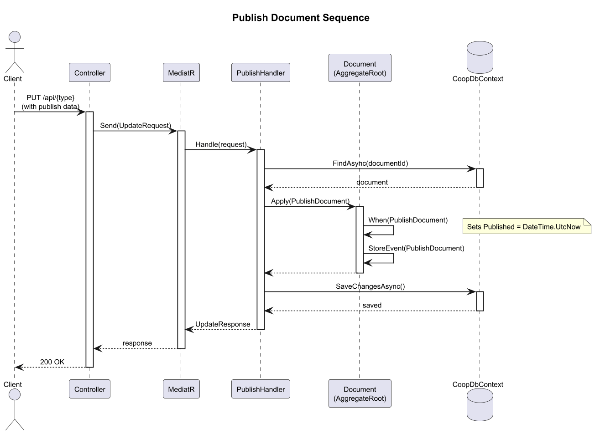
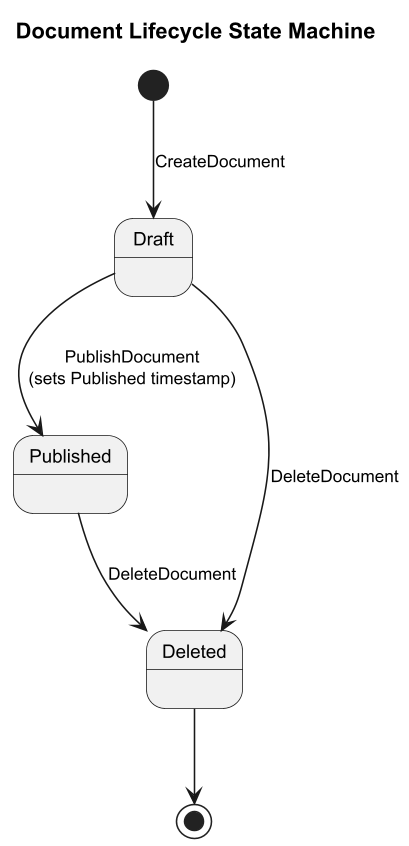

# 06 - Document Management: Detailed Design

## 1. Overview

The Document Management feature provides the Coop platform with the ability to create, publish, and manage organizational documents such as **Notices**, **By-Laws**, and **Reports**. Documents follow an event-sourced lifecycle using domain events and are persisted through Entity Framework Core. Each document type extends a common `Document` aggregate root, inheriting shared properties (name, body, digital asset reference, authorship) while adding type-specific identifiers.

The system exposes dedicated REST API controllers for each document type (plus a general `DocumentController`) and uses the MediatR library to dispatch commands and queries through a CQRS pipeline. In the microservices architecture, the Document service operates as an independent bounded context with its own database, publishing integration events via a message bus to notify other services of document changes.

### Key Capabilities

- **Create** documents of type Notice, ByLaw, or Report with an associated digital asset.
- **Publish** documents by setting a `Published` timestamp, making them visible to members.
- **Delete** documents (both draft and published).
- **Query** documents by ID, list all, filter by published status, or paginate results.
- **Integrate** with the Digital Asset service for file storage and the Identity service for authorship tracking.

## 2. Architecture Diagrams

### 2.1 C4 Context Diagram

Shows the Document Management system in relation to external actors and neighbouring systems.

### 2.2 C4 Container Diagram

Shows the major containers (API, Domain, Infrastructure) that compose the Document Management service.

### 2.3 C4 Component Diagram

Shows the internal components of the Document API container: controllers, MediatR handlers, and domain services.

## 3. Domain Model

### 3.1 Class Diagram

The domain model is built around the `Document` aggregate root. Three concrete document types -- `ByLaw`, `Notice`, and `Report` -- extend the base class. State transitions are driven by domain events: `CreateDocument`, `PublishDocument`, and `DeleteDocument`.

### 3.2 Key Classes

| Class | Role | Namespace |
|-------|------|-----------|
| `Document` | Aggregate root; holds shared document state | `Coop.Domain.Entities` |
| `ByLaw` | Extends Document with `ByLawId` | `Coop.Domain.Entities` |
| `Notice` | Extends Document with `NoticeId` | `Coop.Domain.Entities` |
| `Report` | Extends Document with `ReportId` | `Coop.Domain.Entities` |
| `CreateDocument` | Domain event to initialize a document | `Coop.Domain.DomainEvents` |
| `PublishDocument` | Domain event to set Published timestamp | `Coop.Domain.DomainEvents.Document` |
| `DeleteDocument` | Domain event to mark deletion | `Coop.Domain.DomainEvents.Document` |

## 4. Behavioural Design

### 4.1 Create Document Sequence

Covers the flow from API request through MediatR handler, domain event application, persistence, and optional integration event publication.

### 4.2 Publish Document Sequence

Covers publishing a draft document by applying the `PublishDocument` domain event which sets the `Published` timestamp.

### 4.3 Document Lifecycle State Machine

Documents transition through three states: **Draft**, **Published**, and **Deleted**.

| Transition | Trigger | Effect |
|------------|---------|--------|
| `[*] -> Draft` | `CreateDocument` | Document is created with properties; `Published` may be null |
| `Draft -> Published` | `PublishDocument` | Sets the `Published` timestamp |
| `Draft -> Deleted` | `DeleteDocument` | Document is removed |
| `Published -> Deleted` | `DeleteDocument` | Published document is removed |

## 5. API Surface

### 5.1 DocumentController (`/api/document`)

| Method | Route | Description |
|--------|-------|-------------|
| GET | `/{documentId}` | Get document by ID |
| GET | `/` | Get all documents |
| GET | `/page/{pageSize}/{index}` | Paginated document listing |
| POST | `/` | Create a new document |
| PUT | `/` | Update a document |
| DELETE | `/{documentId}` | Remove a document |

### 5.2 NoticeController (`/api/notice`)

| Method | Route | Description |
|--------|-------|-------------|
| GET | `/{noticeId}` | Get notice by ID |
| GET | `/` | Get all notices |
| GET | `/published` | Get published notices only |
| GET | `/page/{pageSize}/{index}` | Paginated notice listing |
| POST | `/` | Create a new notice |
| PUT | `/` | Update a notice |
| DELETE | `/{noticeId}` | Remove a notice |

### 5.3 ByLawController (`/api/bylaw`)

| Method | Route | Description |
|--------|-------|-------------|
| GET | `/{byLawId}` | Get by-law by ID |
| GET | `/` | Get all by-laws |
| GET | `/published` | Get published by-laws only |
| GET | `/page/{pageSize}/{index}` | Paginated by-law listing |
| POST | `/` | Create a new by-law |
| PUT | `/` | Update a by-law |
| DELETE | `/{byLawId}` | Remove a by-law |

### 5.4 ReportController (`/api/report`)

| Method | Route | Description |
|--------|-------|-------------|
| GET | `/{reportId}` | Get report by ID |
| GET | `/` | Get all reports |
| GET | `/published` | Get published reports only |
| GET | `/page/{pageSize}/{index}` | Paginated report listing |
| POST | `/` | Create a new report |
| PUT | `/` | Update a report |
| DELETE | `/{reportId}` | Remove a report |

## 6. Data Persistence

Documents are stored via Entity Framework Core using the `ICoopDbContext` interface, which exposes `DbSet<T>` properties for `Document`, `Notice`, `ByLaw`, and `Report`. In the microservices variant, the `DocumentDbContext` manages its own database with separate tables for each document type using Table-Per-Type (TPT) or Table-Per-Hierarchy (TPH) inheritance mapping.

### Integration Events

When documents are created, updated, or deleted, integration events (`DocumentCreatedEvent`, `DocumentUpdatedEvent`, `DocumentDeletedEvent`) are published over the message bus using MessagePack serialization. These events allow other bounded contexts (e.g., Notification, Search) to react to document changes.

## 7. Cross-Cutting Concerns

- **Validation**: Each document type has a dedicated validator (e.g., `DocumentValidator`, `NoticeValidator`, `ByLawValidator`, `ReportValidator`).
- **Authorization**: The microservices controllers use `[Authorize]` with `[AllowAnonymous]` on read endpoints.
- **Digital Assets**: Documents reference a `DigitalAssetId` linking to stored files managed by the Digital Asset bounded context.
- **Event Sourcing**: Domain events are stored via `StoredEvent` records for audit and replay capability.
