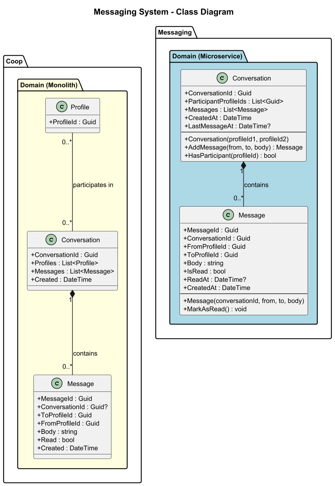
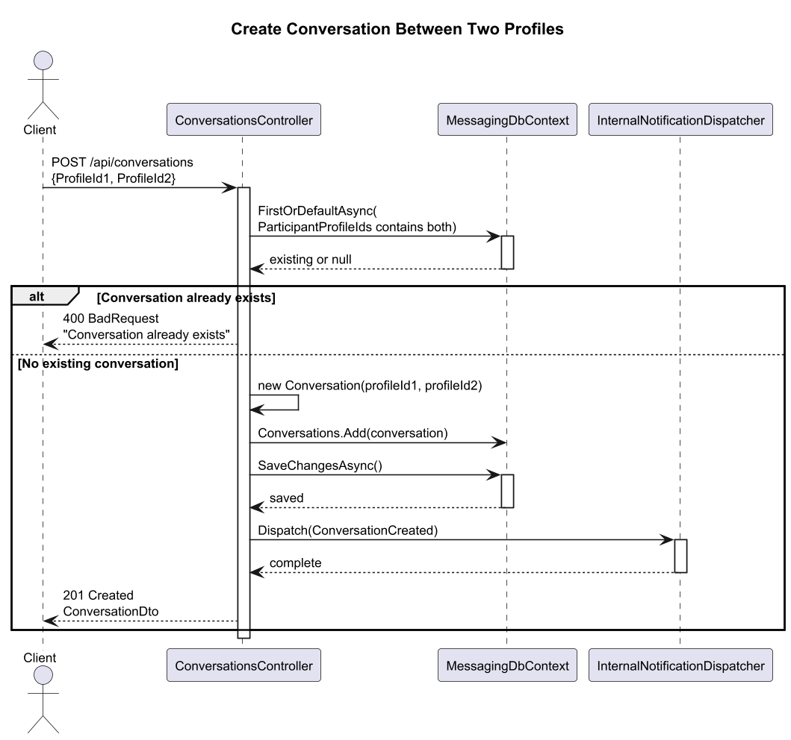
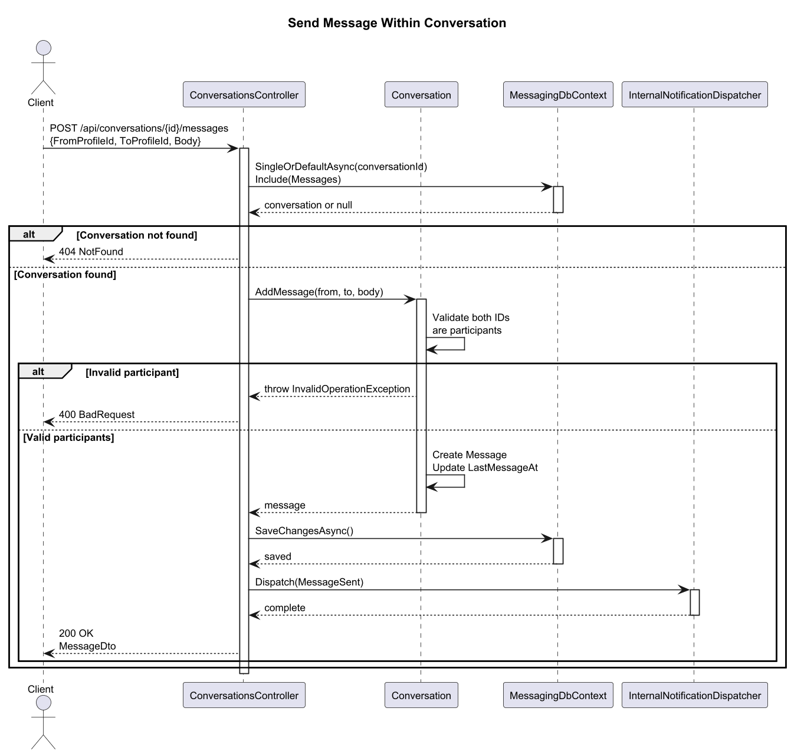
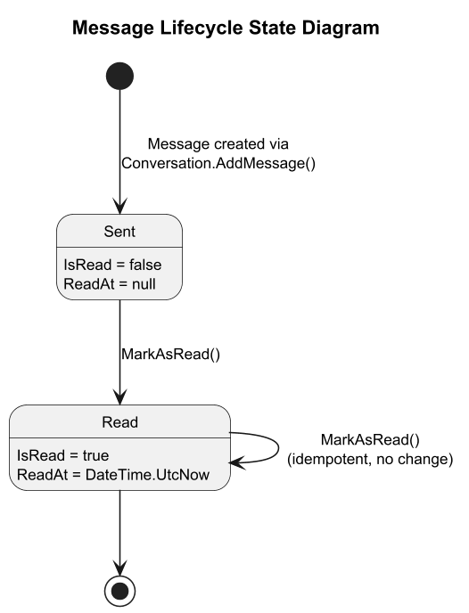
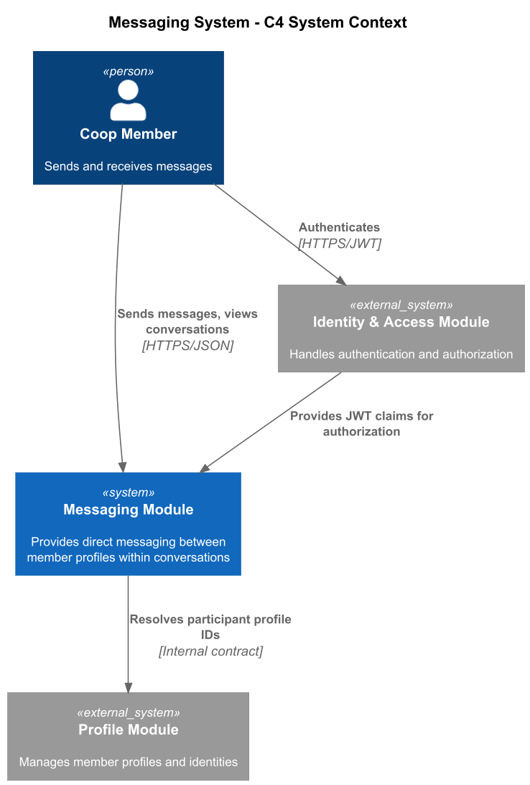
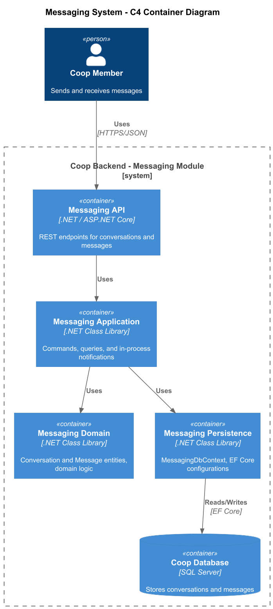
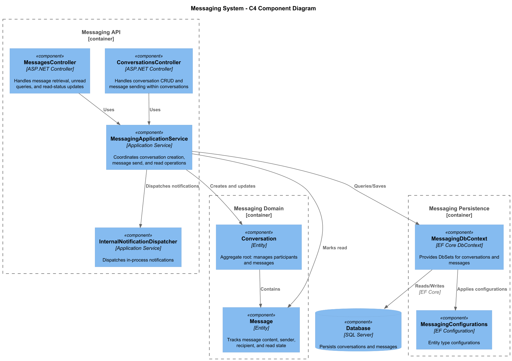

# 07 - Messaging System: Detailed Design

## 1. Overview

The Messaging System provides direct communication between member profiles within the Coop platform. It supports creating conversations between two participants, sending and receiving messages within those conversations, and tracking read/unread status. The system exists in two architectural forms: the original monolith domain model (using EF Core navigation properties between `Profile` and `Conversation`) and the Messaging microservice (using `ParticipantProfileIds` as a list of GUIDs for loose coupling). Both share the same core concepts but differ in how they reference external aggregates.

Key capabilities:
- Create a conversation between two profiles (with duplicate-conversation prevention)
- Send messages within an existing conversation (with participant validation)
- Retrieve conversations by profile, between two profiles, or by ID
- Retrieve messages by conversation (with pagination via skip/take)
- Query unread messages and unread count per profile
- Mark individual messages or entire conversations as read
- Publish domain events (`ConversationCreatedEvent`, `MessageSentEvent`, `MessageReadEvent`) via `IMessageBus`

## 2. Domain Model

### 2.1 Monolith Model (`Coop.Domain`)

| Entity       | Property       | Type              | Notes                        |
|--------------|----------------|-------------------|------------------------------|
| Conversation | ConversationId | Guid              | PK                           |
| Conversation | Profiles       | List\<Profile\>   | Many-to-many navigation      |
| Conversation | Messages       | List\<Message\>   | One-to-many navigation       |
| Conversation | Created        | DateTime          | UTC timestamp                |
| Message      | MessageId      | Guid              | PK                           |
| Message      | ConversationId | Guid?             | FK (nullable)                |
| Message      | ToProfileId    | Guid              | Recipient profile            |
| Message      | FromProfileId  | Guid              | Sender profile               |
| Message      | Body           | string            | Message content              |
| Message      | Read           | bool              | Read status flag             |
| Message      | Created        | DateTime          | UTC timestamp                |

### 2.2 Microservice Model (`Messaging.Domain`)

| Entity       | Property              | Type           | Notes                              |
|--------------|-----------------------|----------------|------------------------------------|
| Conversation | ConversationId        | Guid           | PK, auto-generated                 |
| Conversation | ParticipantProfileIds | List\<Guid\>   | Replaces Profile navigation props  |
| Conversation | Messages              | List\<Message\>| One-to-many owned collection       |
| Conversation | CreatedAt             | DateTime       | UTC timestamp                      |
| Conversation | LastMessageAt         | DateTime?      | Updated on each new message        |
| Message      | MessageId             | Guid           | PK, auto-generated                 |
| Message      | ConversationId        | Guid           | FK (required)                      |
| Message      | FromProfileId         | Guid           | Sender profile                     |
| Message      | ToProfileId           | Guid           | Recipient profile                  |
| Message      | Body                  | string         | Message content                    |
| Message      | IsRead                | bool           | Read status flag                   |
| Message      | ReadAt                | DateTime?      | Timestamp when marked as read      |
| Message      | CreatedAt             | DateTime       | UTC timestamp                      |

Key domain methods:
- `Conversation.AddMessage(fromProfileId, toProfileId, body)` -- validates both IDs are participants, creates Message, updates `LastMessageAt`
- `Conversation.HasParticipant(profileId)` -- membership check
- `Message.MarkAsRead()` -- idempotent; sets `IsRead = true` and `ReadAt` on first call

## 3. Class Diagram

## 4. API Layer

### 4.1 ConversationsController

| Method | Route                                      | Description                              |
|--------|--------------------------------------------|------------------------------------------|
| GET    | /api/conversations/by-profile/{profileId}  | List conversations for a profile         |
| GET    | /api/conversations/{conversationId}        | Get conversation with messages           |
| GET    | /api/conversations/between/{id1}/{id2}     | Find conversation between two profiles   |
| POST   | /api/conversations                         | Create a new conversation                |
| POST   | /api/conversations/{id}/messages           | Send a message in a conversation         |

### 4.2 MessagesController

| Method | Route                                                      | Description                          |
|--------|--------------------------------------------------------------|--------------------------------------|
| GET    | /api/messages/{messageId}                                    | Get a single message                 |
| GET    | /api/messages/by-conversation/{conversationId}               | Paginated messages for conversation  |
| GET    | /api/messages/unread/{profileId}                             | All unread messages for a profile    |
| GET    | /api/messages/unread-count/{profileId}                       | Unread message count                 |
| POST   | /api/messages/{messageId}/read                               | Mark a single message as read        |
| POST   | /api/messages/mark-conversation-read/{conversationId}/{id}   | Mark all messages in conversation    |

All endpoints require `[Authorize]`.

## 5. Sequence Diagrams

### 5.1 Create Conversation

### 5.2 Send Message

## 6. Message Lifecycle State Diagram

## 7. C4 Architecture Diagrams

### 7.1 System Context

### 7.2 Container

### 7.3 Component

## 8. Infrastructure

- **Database**: `MessagingDbContext` (EF Core) with `DbSet<Message>` and `DbSet<Conversation>`
- **Configuration**: Entity configurations applied via `ApplyConfigurationsFromAssembly`
- **Events**: Published via `IMessageBus` -- `ConversationCreatedEvent`, `MessageSentEvent`, `MessageReadEvent`
- **Authorization**: All API endpoints protected with `[Authorize]` attribute

## 9. Key Design Decisions

1. **Participant list as `List<Guid>`** in the microservice avoids cross-service entity references while the monolith uses EF navigation properties.
2. **`LastMessageAt`** on Conversation enables efficient sort-by-recent without joining Messages.
3. **Idempotent `MarkAsRead()`** prevents double-update issues.
4. **Duplicate conversation prevention** at the controller level ensures only one conversation exists between any two profiles.
5. **Pagination** on message retrieval (`skip`/`take`) supports conversations with large message histories.
