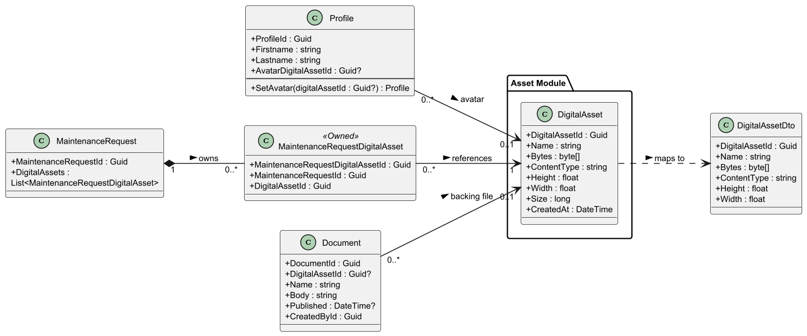
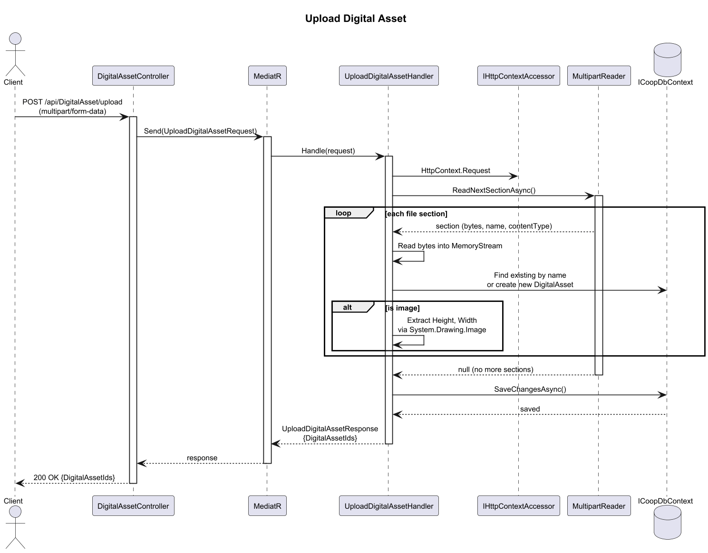
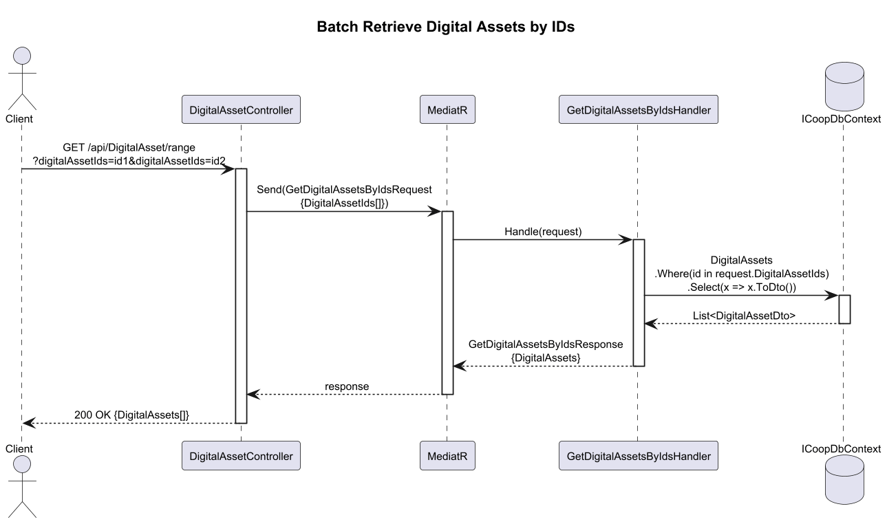
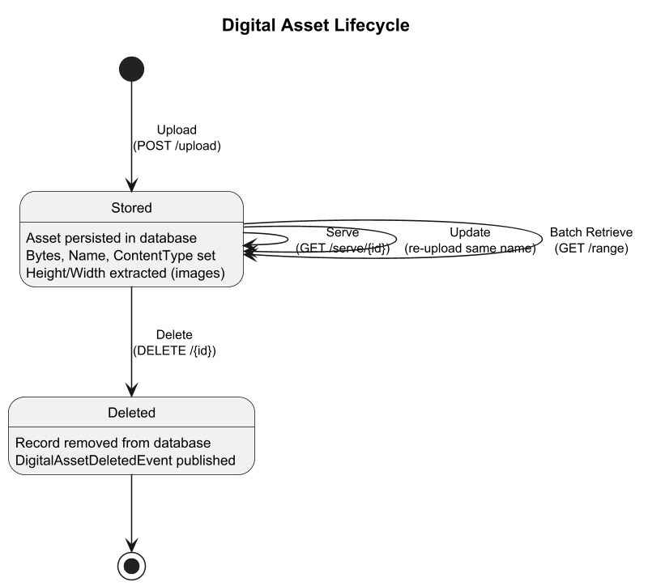
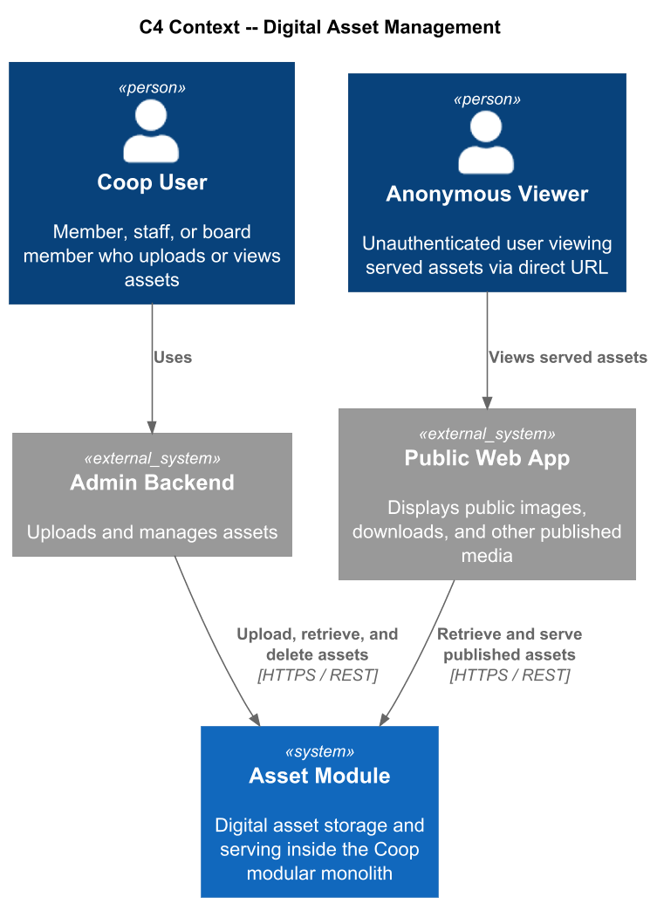
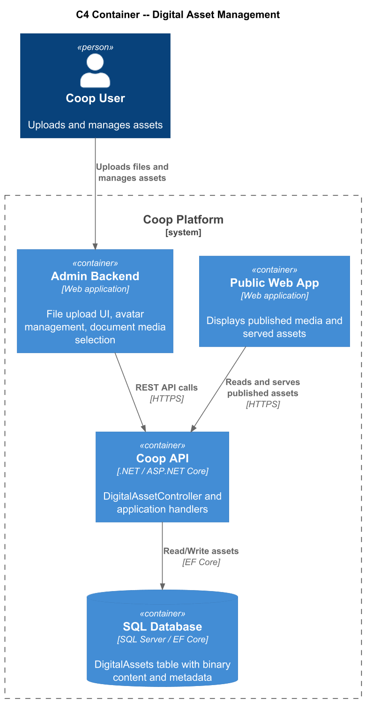
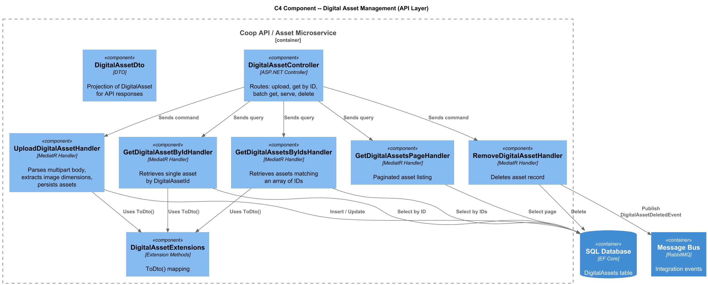

# 08 - Digital Asset Management: Detailed Design

## 1. Overview

The Digital Asset Management feature provides centralized binary storage and retrieval for file-based content across the Coop platform. A **DigitalAsset** stores raw bytes alongside metadata such as file name, MIME type, dimensions, size, and creation time. It is referenced by other modules through foreign-key relationships:

- **Profile.AvatarDigitalAssetId** for profile avatars
- **MaintenanceRequestDigitalAsset** for maintenance photos and evidence
- **Document.DigitalAssetId** for published files and attachments
- **CMS content references** for public-facing imagery and downloadable assets

The Asset module serves both applications: the admin backend uploads and manages assets, while the public web app consumes published images and files through anonymous serving endpoints where appropriate.

### Key design goals

- Keep one source of truth for binary content.
- Support multipart upload and avatar-specific validation.
- Provide anonymous file serving for public content and embedded images.
- Support batch retrieval by ID for efficient view hydration.
- Extract image metadata at upload time.

---

## 2. Domain Model

### 2.1 DigitalAsset Entity

| Property | Type | Description |
|---|---|---|
| DigitalAssetId | `Guid` | Primary key |
| Name | `string` | Original file name |
| Bytes | `byte[]` | Raw binary content |
| ContentType | `string` | MIME type |
| Height | `float` | Image height in pixels, `0` for non-images |
| Width | `float` | Image width in pixels, `0` for non-images |
| Size | `long` | File size in bytes |
| CreatedAt | `DateTime` | UTC creation timestamp |

### 2.2 MaintenanceRequestDigitalAsset

| Property | Type | Description |
|---|---|---|
| MaintenanceRequestDigitalAssetId | `Guid` | Primary key |
| MaintenanceRequestId | `Guid` | FK to the owning maintenance request |
| DigitalAssetId | `Guid` | FK to the referenced digital asset |

Marked `[Owned]` so lifecycle is managed by the parent MaintenanceRequest aggregate.

### 2.3 Internal Notifications

| Notification | Trigger |
|---|---|
| `DigitalAssetCreated` | After upload and persistence |
| `DigitalAssetDeleted` | After deletion |

---

## 3. Class Diagram

---

## 4. Sequence Diagrams

### 4.1 Upload Digital Asset

### 4.2 Batch Retrieve Assets by IDs

---

## 5. State Diagram -- Asset Lifecycle

---

## 6. C4 Architecture Diagrams

### 6.1 Context

### 6.2 Container

### 6.3 Component

---

## 7. API Surface

### DigitalAssetController (`/api/digitalasset`)

| Verb | Route | Description |
|---|---|---|
| POST | `/upload` | Multipart upload of one or more files |
| POST | `/avatar` | Upload avatar image with image-type validation |
| GET | `/{digitalAssetId}` | Retrieve asset metadata and bytes by ID |
| GET | `/range?digitalAssetIds=` | Batch retrieve assets by ID array |
| GET | `/page/{pageSize}/{index}` | Paginated asset listing |
| GET | `/serve/{digitalAssetId}` | Anonymous file serving |
| GET | `/by-name/{name}` | Anonymous file serving by stable name |
| DELETE | `/{digitalAssetId}` | Delete an asset |

---

## 8. Upload Flow

1. Client sends a multipart HTTP POST to `/api/digitalasset/upload`.
2. The upload handler parses each file section and loads bytes into memory or a staging stream.
3. A `DigitalAsset` entity is created with metadata and timestamps.
4. If the file is an image, dimensions are extracted before persistence.
5. The asset is saved in the shared Coop database.
6. The response returns the generated `DigitalAssetId` values.

---

## 9. Serving Flow

The `/serve/{digitalAssetId}` endpoint is marked `[AllowAnonymous]` so that public pages, avatars, and document downloads can reference assets directly. The handler returns the stored bytes with the saved `ContentType`.

---

## 10. Cross-Entity References

| Entity | Property | Relationship |
|---|---|---|
| Profile | `AvatarDigitalAssetId` | Optional FK to avatar image |
| MaintenanceRequestDigitalAsset | `DigitalAssetId` | Required FK to evidence attachment |
| Document | `DigitalAssetId` | Optional FK to document file |
| CMS content | Asset identifiers or URLs | References media used by the public web app |

---

## 11. Data Storage

Assets are stored in the shared Coop database using module-owned tables. Binary content is stored directly in a `varbinary(max)` column or equivalent backing representation, with metadata columns available for filtering and serving.

---

## 12. Documentation Note

Implementation source paths have been intentionally omitted from this design because this repository now stores requirements and design artifacts only.
