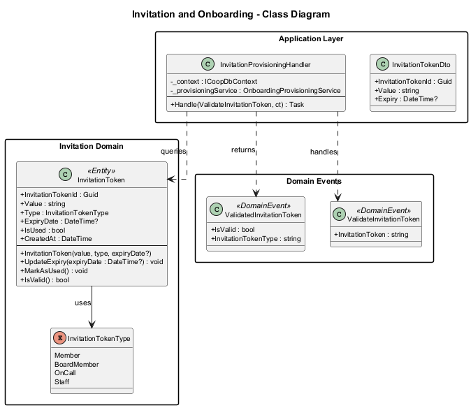
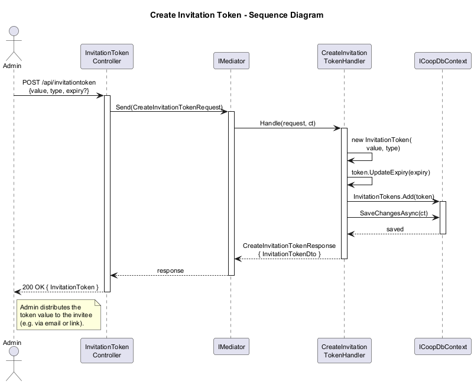
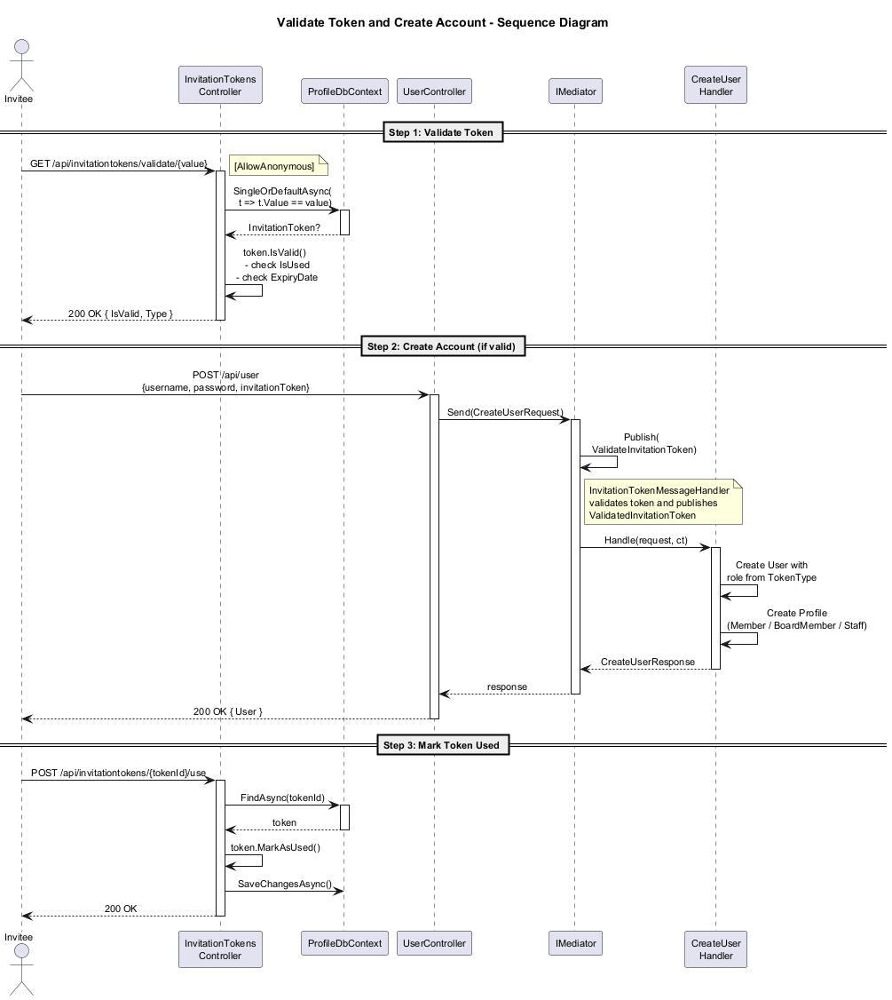
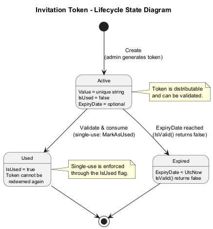
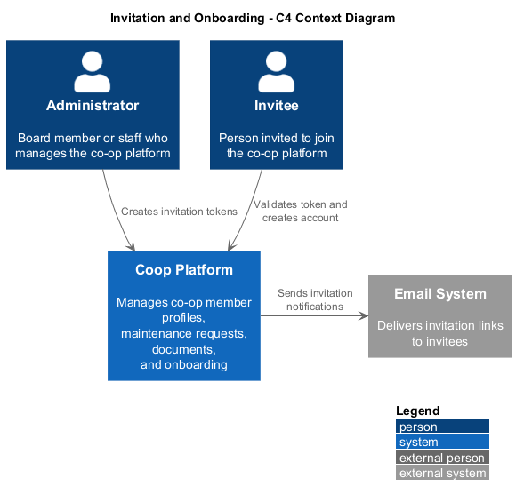
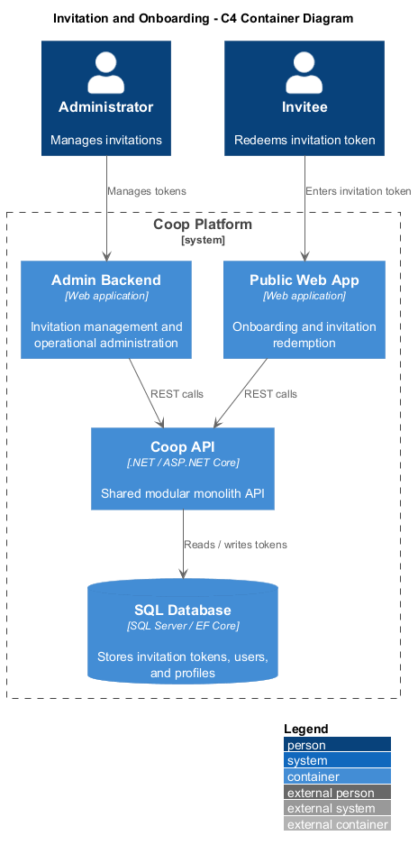
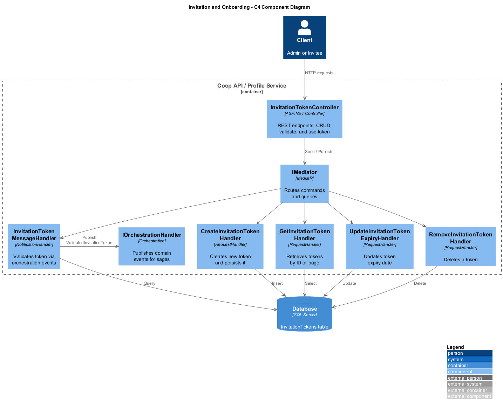

# 09 - Invitation and Onboarding

## Overview

The Invitation and Onboarding feature governs how new members, board members, on-call personnel, and staff are invited to join the Coop platform. An administrator creates an **InvitationToken** -- a unique, optionally time-limited credential -- and shares it with the invitee. The invitee presents the token during account creation; the system validates it, determines the role type, and provisions the user accordingly.

The feature exists in two implementations:

| Aspect | Monolith (`Coop.Domain`) | Microservice (`Profile.Domain`) |
|---|---|---|
| Namespace | `Coop.Domain.Entities` | `Profile.Domain.Entities` |
| Extra state | -- | `IsUsed`, `CreatedAt` |
| Validation | External handler via orchestration | `IsValid()` method on entity |
| Single-use | Not enforced | Enforced via `MarkAsUsed()` |
| Persistence | `ICoopDbContext.InvitationTokens` | `ProfileDbContext.InvitationTokens` |

## Key Components

### Domain Layer

- **InvitationToken** -- aggregate root representing a shareable invitation credential. Carries a unique `Value`, an `InvitationTokenType`, and an optional `Expiry` / `ExpiryDate`. The microservice variant adds `IsUsed` and `CreatedAt` fields plus `MarkAsUsed()` and `IsValid()` methods to enforce single-use semantics.
- **InvitationTokenType** -- enumeration (`Member`, `BoardMember`, `OnCall`, `Staff`) controlling which profile type is created when the token is consumed.
- **ValidateInvitationToken** -- domain event raised when token validation is requested.
- **ValidatedInvitationToken** -- domain event carrying the validation result (`IsValid`, `InvitationTokenType`).

### Application Layer

- **InvitationTokenMessageHandler** -- listens for `ValidateInvitationToken`, queries the database, and publishes `ValidatedInvitationToken` through the orchestration handler.
- **InvitationTokenDto / InvitationTokenExtensions** -- projection and mapping utilities.
- **InvitationTokenValidator** -- FluentValidation rules for the DTO.
- **CQRS Handlers** -- `CreateInvitationToken`, `GetInvitationTokenById`, `GetInvitationTokens`, `GetInvitationTokensPage`, `UpdateInvitationTokenExpiry`, `RemoveInvitationToken`.

### API Layer

- **InvitationTokenController** (monolith) -- authorized REST endpoints for CRUD and pagination.
- **InvitationTokensController** (microservice) -- REST endpoints including an `[AllowAnonymous]` validation endpoint (`GET validate/{value}`) and a `POST {tokenId}/use` endpoint for marking tokens consumed.

### Infrastructure Layer

- **InvitationTokenConfiguration** -- EF Core configuration enforcing a unique index on `Value`, a secondary index on `Type`, and a max length of 512 for the token value.

## Diagrams

### Class Diagram

### Sequence: Create Invitation Token

### Sequence: Validate Token and Create Account

### Token Lifecycle State Diagram

### C4 Context Diagram

### C4 Container Diagram

### C4 Component Diagram

## Design Decisions

1. **Single-use enforcement** -- The microservice implementation adds `IsUsed` to prevent token reuse, closing a gap in the original monolith design.
2. **Anonymous validation endpoint** -- The microservice exposes `validate/{value}` without authentication so the onboarding UI can verify a token before asking the user to fill in registration details.
3. **Orchestration-based validation** -- In the monolith, token validation flows through `IOrchestrationHandler`, enabling saga-style coordination with the user-creation workflow.
4. **Type-driven provisioning** -- `InvitationTokenType` maps directly to the profile subclass (`Member`, `BoardMember`, `StaffMember`) created during onboarding.
