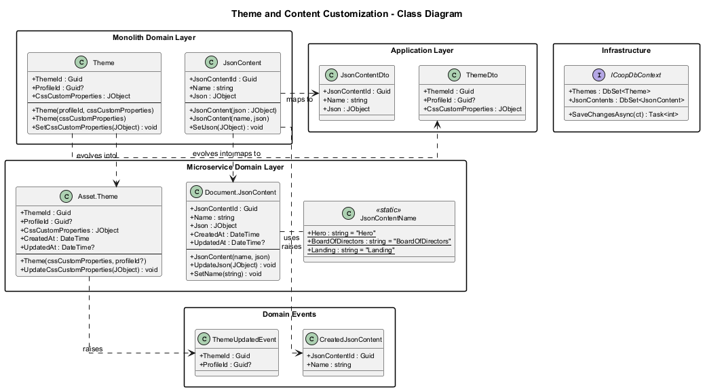
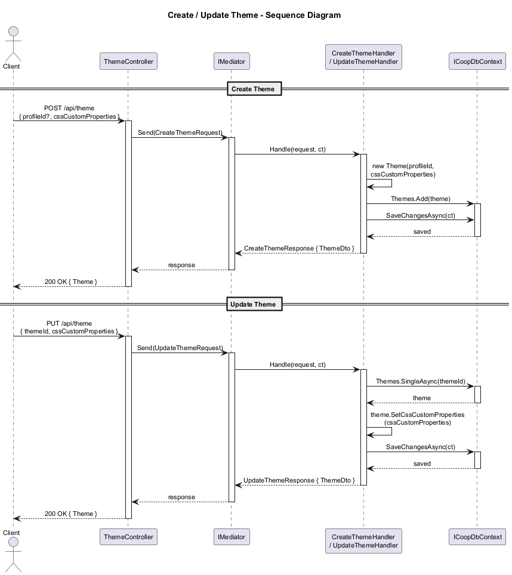
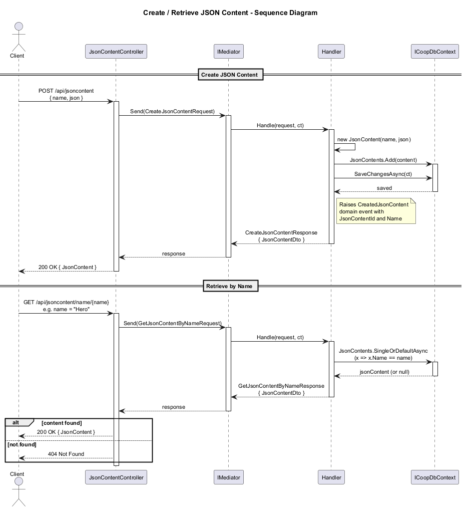
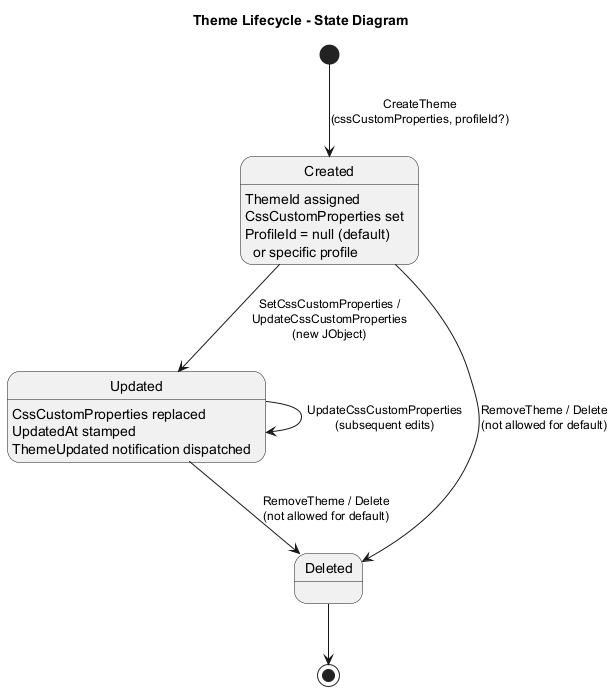
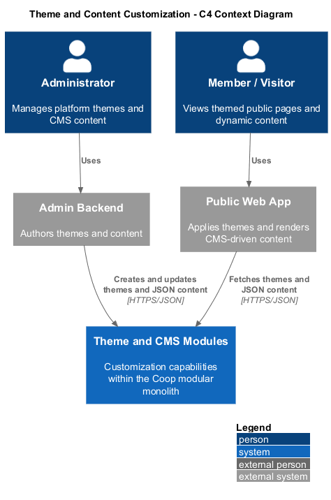
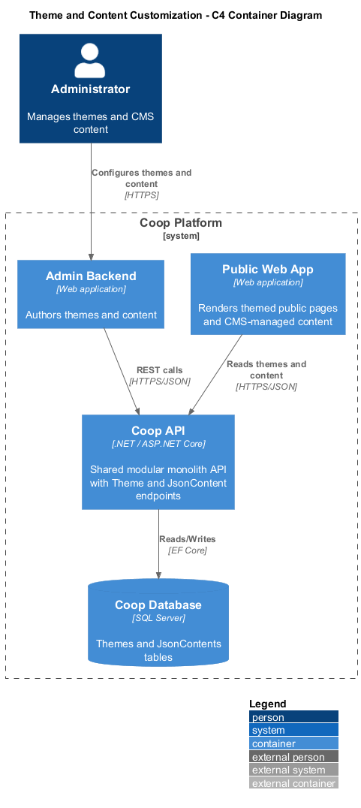
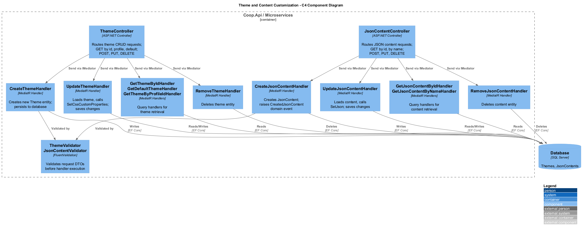

# 10 - Theme and Content Customization: Detailed Design

## 1. Overview

The Theme and Content Customization feature provides the CMS capabilities required by the Coop platform. It enables the **admin backend** to manage branding and public-facing content while enabling the **public web app** to render that content without redeployment.

It is composed of two complementary sub-features:

- **Theme**: stores CSS custom properties (design tokens) as JSON so branding can be updated globally or per profile.
- **JsonContent**: stores named, structured JSON content blocks that power public pages such as the landing hero, board listing, announcements, and other CMS-driven sections.

Both entities follow the platform's standard CQRS, MediatR, and Entity Framework patterns inside the modular monolith.

### Key design goals

- Allow administrators to change visual branding at runtime.
- Support a default theme and optional profile-specific overrides.
- Provide a lightweight CMS store for public web app sections identified by well-known names.
- Let published content changes reach the public site without a redeploy.
- Keep content and theme updates auditable and manageable through the admin backend.

---

## 2. Domain Model

### 2.1 Theme Entity

| Property | Type | Description |
|---|---|---|
| ThemeId | `Guid` | Primary key |
| ProfileId | `Guid?` | Optional FK to owning profile; `null` means global default |
| CssCustomProperties | `JObject` | JSON object containing CSS custom property key-value pairs |
| CreatedAt | `DateTime` | Creation timestamp |
| UpdatedAt | `DateTime?` | Last update timestamp |

Methods include `SetCssCustomProperties(JObject)` and `UpdateCssCustomProperties(JObject)`.

### 2.2 JsonContent Entity

| Property | Type | Description |
|---|---|---|
| JsonContentId | `Guid` | Primary key |
| Name | `string` | Well-known content key such as `Hero` |
| Json | `JObject` | Arbitrary JSON payload consumed by the public web app |
| CreatedAt | `DateTime` | Creation timestamp |
| UpdatedAt | `DateTime?` | Last update timestamp |

Methods include `SetJson(JObject)`, `UpdateJson(JObject)`, and `SetName(string)`.

### 2.3 Well-Known Content Names

| Constant | Value |
|---|---|
| `Hero` | `"Hero"` |
| `BoardOfDirectors` | `"BoardOfDirectors"` |
| `Landing` | `"Landing"` |

---

## 3. Class Diagram

---

## 4. Sequence Diagrams

### 4.1 Create / Update Theme

### 4.2 Create / Retrieve JSON Content by Name

---

## 5. State Diagram -- Theme Lifecycle

---

## 6. C4 Architecture Diagrams

### 6.1 Context

### 6.2 Container

### 6.3 Component

---

## 7. API Surface

### ThemeController (`/api/theme`)

| Verb | Route | Description |
|---|---|---|
| GET | `/{themeId}` | Retrieve a single theme by ID |
| GET | `/default` | Retrieve the global default theme |
| GET | `/profile/{profileId}` | Retrieve the theme for a specific profile |
| GET | `/` | List all themes |
| GET | `/page/{pageSize}/{index}` | Paginated theme listing |
| POST | `/` | Create a new theme |
| PUT | `/` | Update an existing theme's CSS properties |
| DELETE | `/{themeId}` | Delete a theme |

### JsonContentController (`/api/jsoncontent`)

| Verb | Route | Description |
|---|---|---|
| GET | `/{jsonContentId}` | Retrieve content by ID |
| GET | `/name/{name}` | Retrieve content by well-known name |
| GET | `/` | List all JSON content entries |
| GET | `/page/{pageSize}/{index}` | Paginated content listing |
| POST | `/` | Create a new content entry |
| PUT | `/` | Update an existing content entry |
| DELETE | `/{jsonContentId}` | Delete a content entry |

---

## 8. Domain Events and Notifications

| Event / Notification | Trigger | Purpose |
|---|---|---|
| `CreatedJsonContent` | New content saved | Audit trail and cache invalidation |
| `ThemeUpdated` | Theme properties updated | Refresh public-site theming projections |

---

## 9. Data Storage

Themes and JSON content are persisted in the shared Coop database through module-owned tables. `CssCustomProperties` and `Json` values are stored as JSON-capable text columns with serialization handled by the application layer.

---

## 10. Validation

- **ThemeValidator** ensures `CssCustomProperties` is present and well-formed.
- **JsonContentValidator** ensures `Name` and `Json` are present.
- Duplicate prevention ensures only one theme exists per profile and that content names remain unique where required by the CMS contract.

---

## 11. CMS Responsibilities

- The **admin backend** authors and publishes themes and content blocks.
- The **public web app** resolves content by well-known names and applies the current theme at runtime.
- The CMS contract is intentionally simple so public pages can be rendered from stable JSON shapes without coupling to internal database identifiers.

---

## 12. Documentation Note

Implementation source paths have been intentionally omitted from this design because this repository now stores requirements and design artifacts only.
