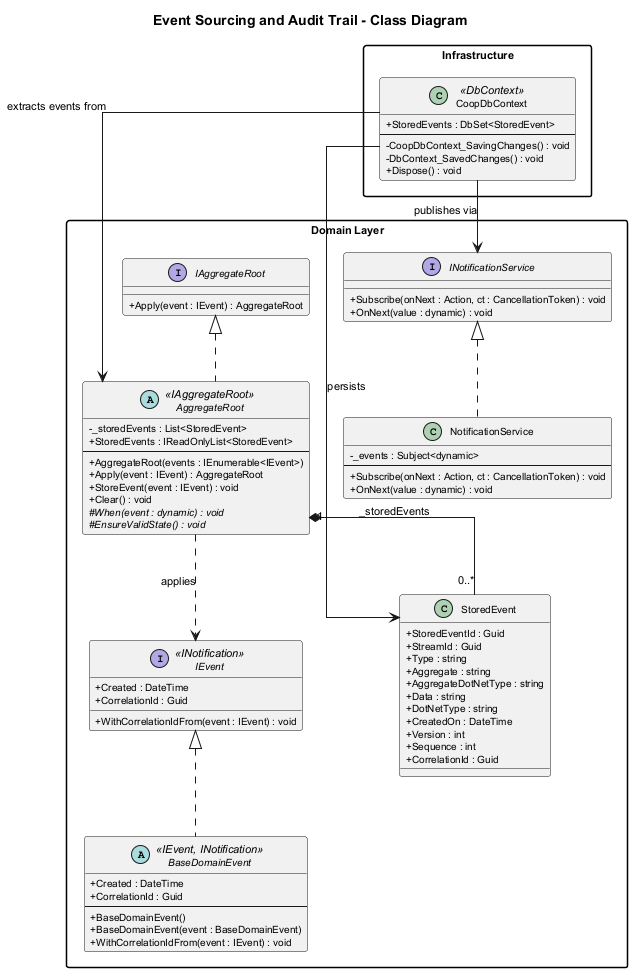
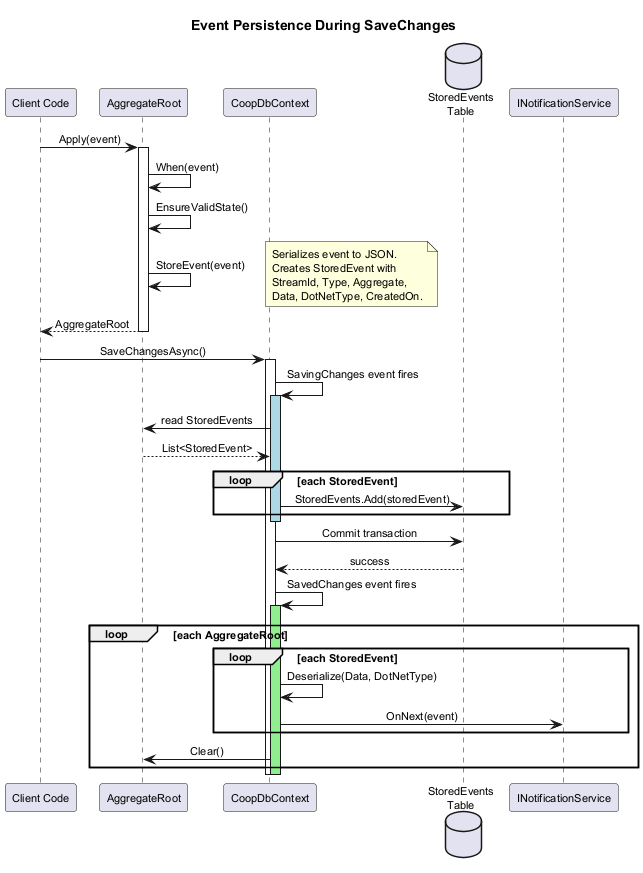
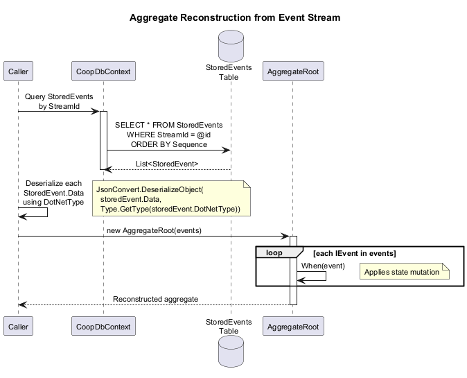
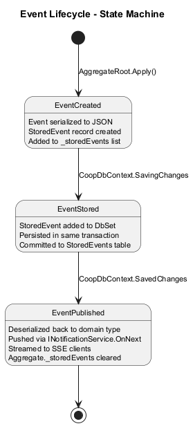
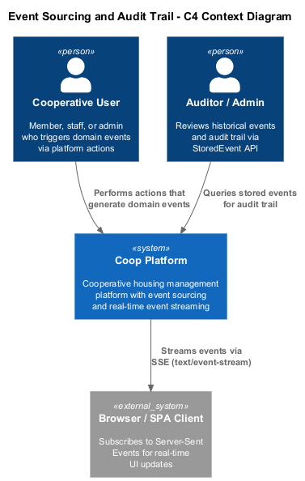
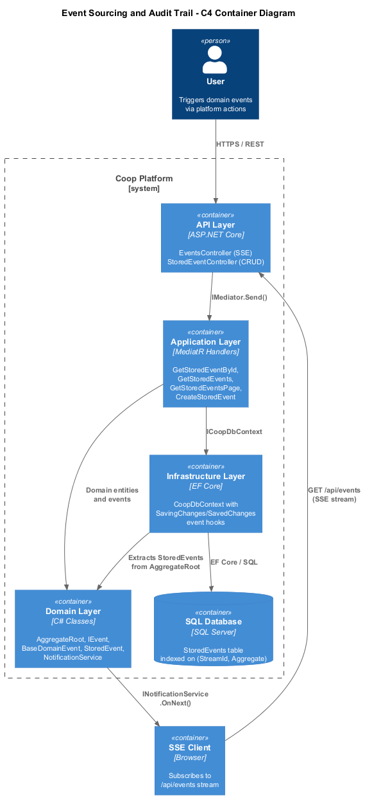
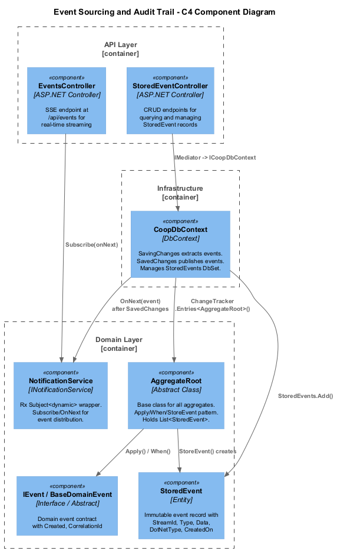

# 11 - Event Sourcing and Audit Trail

## Overview

The Coop platform implements an event sourcing pattern where every state change to an aggregate is captured as an immutable `StoredEvent` and persisted alongside the aggregate itself within a single database transaction. After persistence, events are published in real time through a reactive `INotificationService` over Server-Sent Events (SSE), enabling clients to receive live updates without polling.

This design provides a complete audit trail of all domain mutations, supports aggregate state reconstruction from the event stream, and decouples downstream consumers from the write model.

## Key Design Decisions

1. **Single-transaction persistence** -- `StoredEvent` records are extracted from aggregate roots during the EF Core `SavingChanges` hook and added to the same `DbContext` change set, guaranteeing atomicity with the aggregate state change.
2. **Post-save publication** -- Events are deserialized and pushed through `INotificationService` (backed by `System.Reactive.Subject<dynamic>`) during the `SavedChanges` hook, ensuring consumers only receive committed events.
3. **Dynamic dispatch via `When(dynamic)`** -- `AggregateRoot.Apply` calls `When(dynamic)` so concrete aggregates can pattern-match on strongly-typed event classes without a central switch.
4. **Reflection-based stream identity** -- `StoreEvent` resolves the aggregate's identity property by convention (`{TypeName}Id`), keeping the base class free of generic parameters.

## Components

### AggregateRoot (abstract base class)

Maintains an internal `List<StoredEvent>` that accumulates events produced by the `Apply` method. Each call to `Apply`:

- Invokes `When(dynamic)` to mutate state.
- Calls `EnsureValidState()` to enforce invariants.
- Calls `StoreEvent()` to serialize the event and append a `StoredEvent` record.

The `Clear()` method is called by `CoopDbContext` after publication to reset the list.

### IAggregateRoot / IEvent / BaseDomainEvent

- **IAggregateRoot** -- exposes `Apply(IEvent)`.
- **IEvent** -- extends `INotification` (MediatR); carries `Created`, `CorrelationId`, and `WithCorrelationIdFrom`.
- **BaseDomainEvent** -- abstract base implementing `IEvent` with auto-generated timestamps and correlation IDs.

### StoredEvent

Persisted to the `StoredEvents` table with a composite index on `(StreamId, Aggregate)`. Fields include the serialized event `Data`, the .NET type information for deserialization, `CreatedOn`, `Version`, `Sequence`, and `CorrelationId`.

### CoopDbContext

Subscribes to two EF Core lifecycle events:

- **SavingChanges** -- iterates all tracked `AggregateRoot` entities in Added or Modified state, extracts their `StoredEvents`, and adds each to `DbSet<StoredEvent>`.
- **SavedChanges** -- iterates all tracked `AggregateRoot` entities, deserializes each stored event back to its domain type, and pushes it through `INotificationService.OnNext`. Then calls `Clear()` on the aggregate.

### NotificationService

Wraps `System.Reactive.Subjects.Subject<dynamic>`. Provides `Subscribe(Action<dynamic>, CancellationToken)` and `OnNext(dynamic)`.

### EventsController

Exposes `GET /api/events` as an SSE endpoint. Sets `Content-Type: text/event-stream`, subscribes to `INotificationService`, and writes each event as a JSON-serialized `data:` frame.

### StoredEventController

Standard CRUD REST controller providing paginated read access to the `StoredEvents` table via MediatR handlers (`GetStoredEventById`, `GetStoredEvents`, `GetStoredEventsPage`, `CreateStoredEvent`, `UpdateStoredEvent`, `RemoveStoredEvent`).

## Diagrams

### Class Diagram

### Sequence: Event Persistence

### Sequence: Event Replay (Aggregate Reconstruction)

### State Machine: Event Lifecycle

### C4 Context

### C4 Container

### C4 Component

## Documentation Note

Implementation source paths have been intentionally omitted from this design because this repository now stores requirements and design artifacts only.
