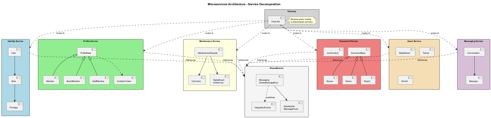
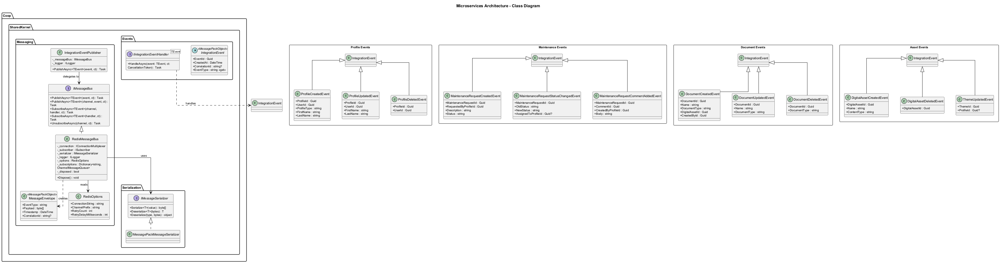
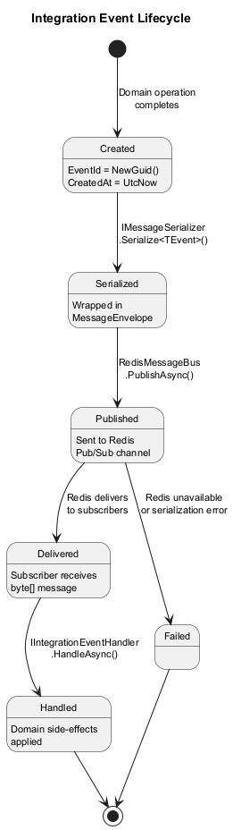
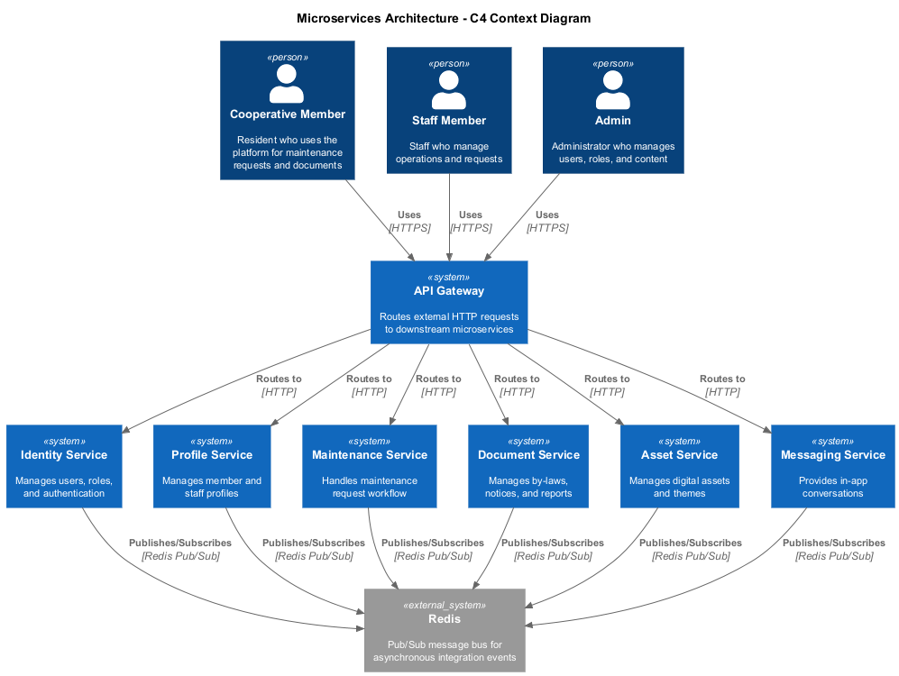
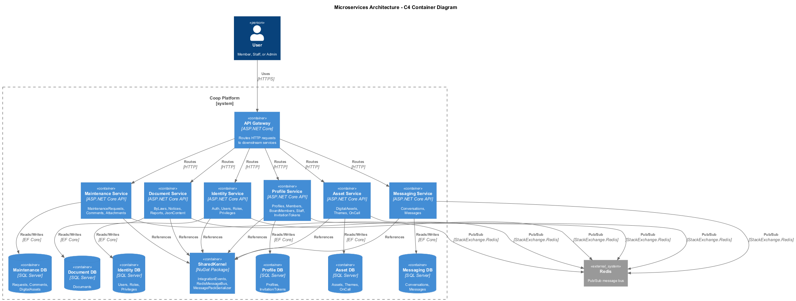
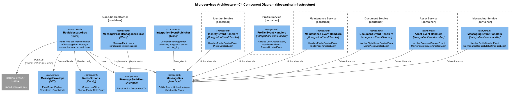

# 12 - Microservices Architecture

## Overview

The Coop platform is decomposed into six independently deployable microservices, each owning its own domain, data store, and API surface. Services communicate asynchronously through a Redis-backed message bus using MessagePack-serialized integration events. A shared kernel library (`Coop.SharedKernel`) provides the messaging infrastructure, serialization primitives, and integration event contracts that all services depend on.

This design enables each service to evolve, scale, and deploy independently while maintaining eventual consistency across bounded contexts through a publish/subscribe eventing model.

## Architecture Principles

- **Database per Service** -- Each microservice owns a dedicated database (or schema). No service reads or writes another service's data store directly.
- **Asynchronous Communication** -- Cross-service communication uses integration events published to Redis Pub/Sub channels. There are no synchronous service-to-service HTTP calls.
- **Shared Nothing** -- Services share only the `Coop.SharedKernel` NuGet package containing event contracts and messaging infrastructure. Domain models are never shared.
- **Event-Driven Consistency** -- State that must be visible across services is propagated via integration events. Services maintain local read models when they need data owned by another service.

## Service Decomposition

| Service | Bounded Context | Key Entities | Port |
|---------|----------------|--------------|------|
| **Identity Service** | Authentication and authorization | User, Role, Privilege | 5001 |
| **Profile Service** | Member and staff profiles | ProfileBase, Member, BoardMember, StaffMember, InvitationToken | 5002 |
| **Maintenance Service** | Maintenance request workflow | MaintenanceRequest, MaintenanceRequestComment, MaintenanceRequestDigitalAsset | 5003 |
| **Document Service** | Document management | DocumentBase, ByLaw, Notice, Report, JsonContent | 5004 |
| **Asset Service** | Digital assets and theming | DigitalAsset, Theme, OnCall | 5005 |
| **Messaging Service** | In-app messaging | Conversation, Message | 5006 |



## Messaging Infrastructure

### Redis Message Bus

All inter-service communication flows through `RedisMessageBus`, which implements the `IMessageBus` interface. The bus wraps StackExchange.Redis Pub/Sub, serializing events into `MessageEnvelope` wrappers using MessagePack for compact binary encoding.

Channel names follow the pattern `{ChannelPrefix}:{EventTypeName}` (e.g., `coop:profilecreatedevent`). Each service subscribes to the event types it cares about at startup.

### MessageEnvelope

Every event published to Redis is wrapped in a `MessageEnvelope` containing:

| Field | Type | Description |
|-------|------|-------------|
| EventType | string | Assembly-qualified type name for deserialization |
| Payload | byte[] | MessagePack-serialized event body |
| Timestamp | DateTime | UTC time the envelope was created |
| CorrelationId | string? | Optional trace correlation identifier |

### Serialization

The `IMessageSerializer` interface abstracts serialization. The default implementation (`MessagePackMessageSerializer`) uses MessagePack with `StandardResolver` and `ContractlessStandardResolver` for high-performance binary serialization. All integration events and the `MessageEnvelope` are annotated with `[MessagePackObject]` and `[Key(n)]` attributes.



## Integration Events

Integration events extend the abstract `IntegrationEvent` base class, which provides:

| Property | Type | Description |
|----------|------|-------------|
| EventId | Guid | Unique event identifier (auto-generated) |
| CreatedAt | DateTime | UTC creation timestamp (auto-generated) |
| CorrelationId | string? | Optional correlation for distributed tracing |
| EventType | string | Derived type name (computed from `GetType().Name`) |

### Event Catalog

| Event | Published By | Consumed By |
|-------|-------------|-------------|
| `UserCreatedEvent` | Identity | Profile |
| `UserDeletedEvent` | Identity | Profile, Messaging |
| `UserRoleChangedEvent` | Identity | Profile |
| `ProfileCreatedEvent` | Profile | Messaging, Maintenance |
| `ProfileUpdatedEvent` | Profile | Messaging, Maintenance |
| `ProfileDeletedEvent` | Profile | Messaging, Maintenance |
| `MaintenanceRequestCreatedEvent` | Maintenance | Messaging, Asset |
| `MaintenanceRequestStatusChangedEvent` | Maintenance | Messaging |
| `MaintenanceRequestCommentAddedEvent` | Maintenance | Messaging |
| `DocumentCreatedEvent` | Document | Asset, Messaging |
| `DocumentUpdatedEvent` | Document | Asset |
| `DocumentDeletedEvent` | Document | Asset |
| `DigitalAssetCreatedEvent` | Asset | Document, Maintenance |
| `DigitalAssetDeletedEvent` | Asset | Document, Maintenance |
| `ThemeUpdatedEvent` | Asset | Profile |
| `MessageSentEvent` | Messaging | -- (notifications) |
| `MessageReadEvent` | Messaging | -- (notifications) |
| `ConversationCreatedEvent` | Messaging | -- (notifications) |

## Event Flow

### Publishing

When a service completes a domain operation, it creates an integration event and delegates to `IntegrationEventPublisher`, which calls `IMessageBus.PublishAsync`. The `RedisMessageBus` serializes the event into a `MessageEnvelope`, then publishes the envelope bytes to the appropriate Redis channel.


### Subscribing

At startup each service registers handlers for the integration events it consumes. When Redis delivers a message, `RedisMessageBus` deserializes the `MessageEnvelope`, extracts and deserializes the inner event payload, and invokes the registered `IIntegrationEventHandler<TEvent>.HandleAsync` method.


### Event Lifecycle

An integration event transitions through the following states:



## Deployment Topology

Each microservice runs as an independent ASP.NET Core process. All services connect to a shared Redis instance for Pub/Sub messaging. Each service has its own database (SQL Server or SQLite depending on environment). The original `Coop.Api` project serves as the API Gateway, routing external HTTP requests to the appropriate downstream service.







## SharedKernel Package

The `Coop.SharedKernel` project is the only shared dependency across all services. It contains:

- **Events/** -- `IntegrationEvent` base class, `IIntegrationEventHandler<TEvent>` interface, and all concrete integration event definitions organized by domain (Asset, Document, Identity, Maintenance, Messaging, Profile).
- **Messaging/** -- `IMessageBus` interface, `RedisMessageBus` implementation, `RedisOptions` configuration, `MessageEnvelope` wire format, and `IntegrationEventPublisher` convenience wrapper.
- **Serialization/** -- `IMessageSerializer` interface, `MessagePackMessageSerializer` implementation, and `MessagePackSerializerConfig` static configuration.
- **Extensions/** -- `ServiceCollectionExtensions` providing `AddSharedKernel`, `AddRedisMessaging`, and `AddMessagePackSerialization` registration methods.

## Configuration

Each service configures Redis connectivity via the `Redis` configuration section:

```json
{
  "Redis": {
    "ConnectionString": "localhost:6379",
    "ChannelPrefix": "coop",
    "RetryCount": 3,
    "RetryDelayMilliseconds": 1000
  }
}
```

Services register the shared kernel at startup:

```csharp
builder.Services.AddSharedKernel(builder.Configuration);
```

## Key Design Decisions

1. **Redis Pub/Sub over a full message broker** -- Redis was chosen for simplicity and low operational overhead. The platform's scale does not currently warrant RabbitMQ or Kafka. This can be swapped by implementing a new `IMessageBus`.

2. **MessagePack over JSON** -- Binary serialization reduces payload size and serialization time. All events use `[MessagePackObject]` attributes for explicit member ordering.

3. **Assembly-qualified type names in envelopes** -- The `MessageEnvelope.EventType` stores the full assembly-qualified name, enabling polymorphic deserialization on the subscriber side.

4. **No saga/orchestration** -- Current cross-service workflows are simple enough to handle with choreography (event reactions). If complex multi-step transactions arise, a saga pattern can be introduced.

5. **Gateway as reverse proxy** -- The original monolith API (`Coop.Api`) is retained as the API Gateway, forwarding requests to downstream services. This preserves the existing client contract.
