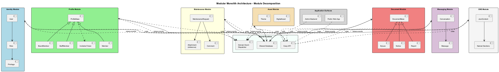
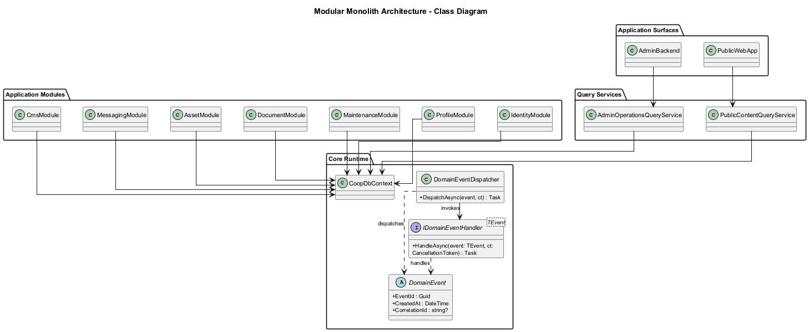
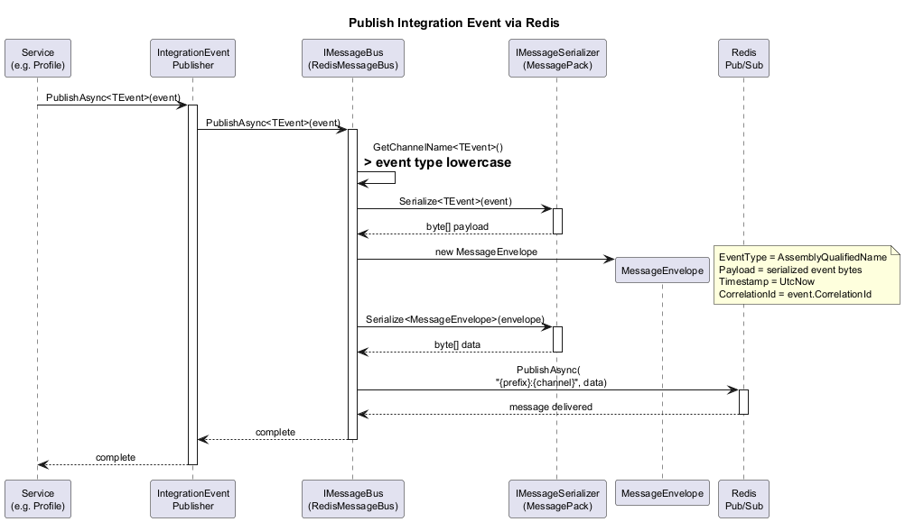
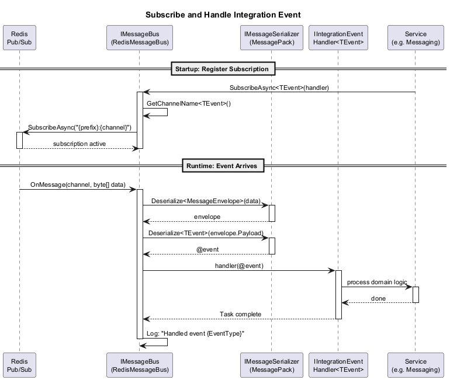
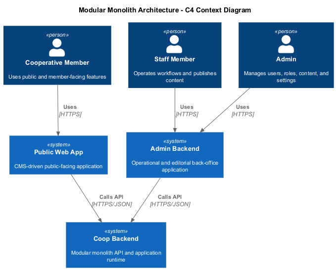

# 12 - Modular Monolith Architecture

## Overview

The Coop platform is implemented as a **modular monolith**: one deployable backend organized into explicit business modules, one shared database with module-owned structures, and one shared API consumed by **two applications**:

- a **CMS-driven public-facing web app**
- an **admin backend**

This architecture keeps deployment and operations simple while preserving clear module boundaries across Identity, Profile, Maintenance, Document, Asset, Messaging, and CMS-related capabilities.

## Architecture Principles

- **Single deployable backend**: all modules run in one application process.
- **Explicit module boundaries**: each module owns its data and business rules.
- **In-process collaboration**: modules coordinate through application services, internal interfaces, and domain notifications rather than network calls.
- **Shared data platform**: one database is used, but ownership of tables or schemas remains module-specific.
- **Two application surfaces**: the public site and the admin backend share the same backend capabilities without duplicating core business logic.

## Module Decomposition

| Module | Responsibility | Key Concepts |
|---|---|---|
| **Identity** | Authentication, users, roles, privileges | User, Role, Privilege |
| **Profile** | Profile lifecycle and active-profile context | ProfileBase, Member, StaffMember, BoardMember, InvitationToken |
| **Maintenance** | Maintenance workflow and evidence | MaintenanceRequest, Comment, Attachment |
| **Document** | Authoring and publishing of cooperative documents | Document, Notice, ByLaw, Report |
| **Asset** | Binary media and theme assets | DigitalAsset, Theme |
| **Messaging** | Conversations and messages | Conversation, Message |
| **CMS** | Public-site content composition | JsonContent, named content sections |

## Application Surfaces

| Application | Audience | Primary Responsibilities |
|---|---|---|
| **Public Web App** | Residents, members, visitors | Render CMS-managed pages, published documents, public media, onboarding, and member-facing workflows |
| **Admin Backend** | Staff, board members, administrators | Manage users, roles, content, profiles, maintenance, documents, assets, and invitations |

## Internal Communication Model

Cross-module workflows stay inside the same process.

- Commands and queries flow through the API and MediatR pipeline.
- Domain events and notifications are dispatched in-process.
- Module integrations use internal contracts rather than service-to-service HTTP or external message buses.

## Event and Notification Flow

### Dispatching

When a module completes a business operation, it can raise a domain event or internal notification. The dispatcher invokes interested handlers inside the same runtime, allowing dependent modules to update projections, audit data, or secondary state.

### Handling

Handlers are registered at application startup and execute in-process when matching events are raised.

### Lifecycle

Internal events move through creation, dispatch, handling, and completion inside the same backend.

## Deployment Topology

The platform is deployed as:

- one backend application
- one shared SQL database
- one public web app
- one admin backend

## Data Boundaries

- Modules own their own tables or schemas.
- Cross-module reads are exposed through application services, projections, or approved data-access abstractions.
- Transactions may span multiple modules when a single business operation requires atomic consistency.

## Key Design Decisions

1. **Modular monolith over distributed services** keeps deployment, local development, and operational support simpler for the Coop's scale and team size.
2. **One shared backend for two apps** centralizes business rules and avoids duplicated API logic between the public site and the admin backend.
3. **In-process notifications over external messaging** reduce infrastructure complexity while still enabling loose coupling between modules.
4. **Module-owned persistence inside one database** preserves boundaries without introducing multi-database operational overhead.
5. **CMS as a first-class capability** ensures the public-facing site is content-driven and editable through the admin backend.
