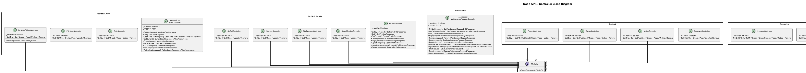
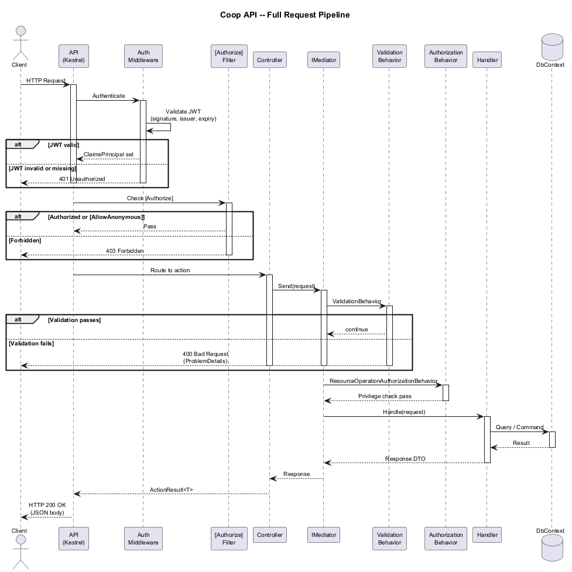
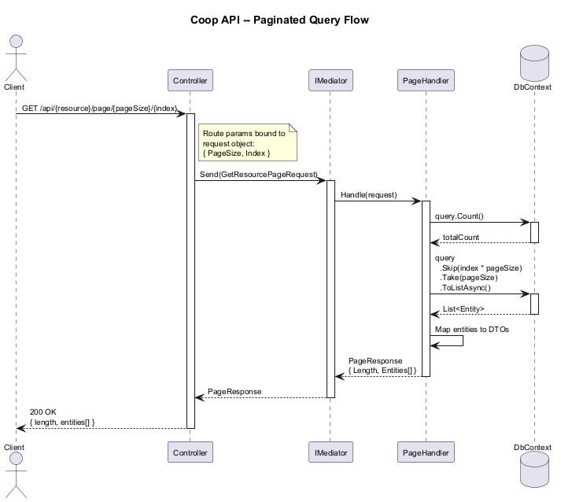
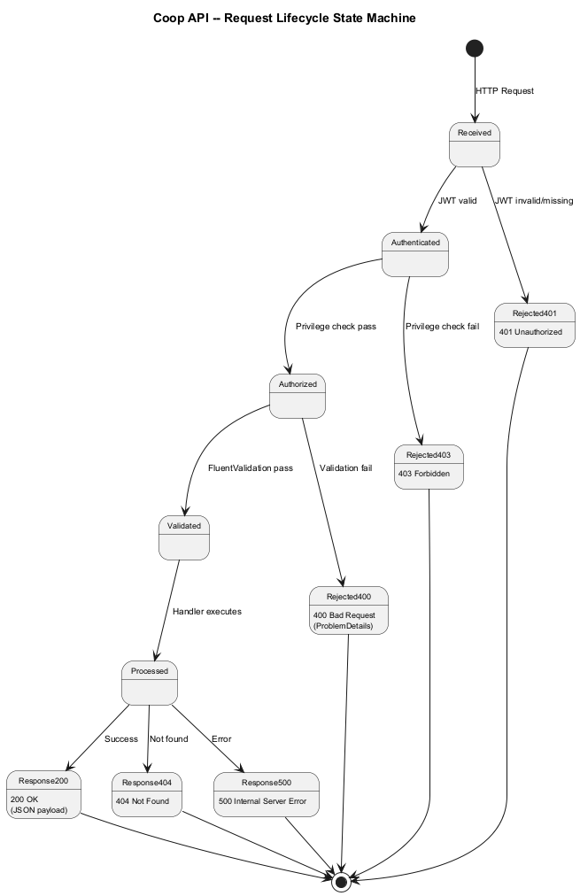
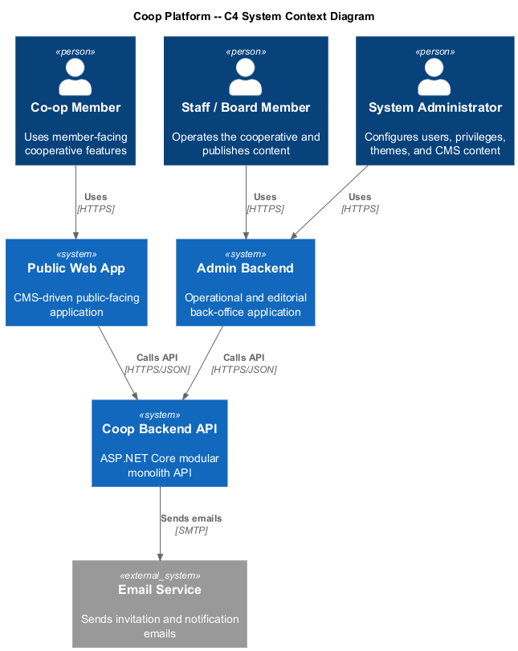
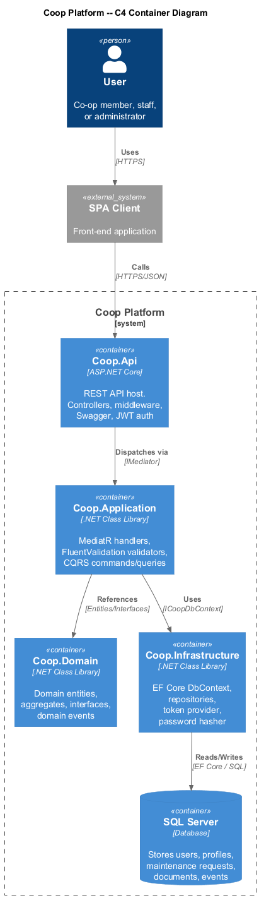
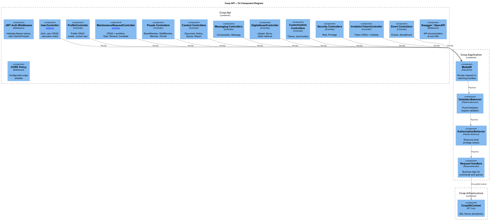

# 13 - API Layer: Detailed Design

## 1. Overview

The Coop API Layer is the shared backend surface for both application clients:

- the **CMS-driven public-facing web app**
- the **admin backend**

It is implemented as an ASP.NET Core REST API on **.NET 10 LTS** within the modular monolith. Both client applications are assumed to be **Angular 21** applications. Controllers delegate to `IMediator`, which routes commands and queries through validation, authorization, and application handlers before reaching persistence.

The API uses **JWT Bearer authentication** for protected operations, **FluentValidation** for request validation, and **Swagger/OpenAPI** for interactive documentation.

### Key Architectural Decisions

| Decision | Rationale |
|---|---|
| One shared API for both apps | Keeps business rules and authorization centralized |
| Thin controllers | Business logic remains in application handlers |
| MediatR pipeline | Validation and authorization stay consistent across modules |
| Public and admin access differentiated by route design and authorization | Supports two apps without duplicating backend logic |
| Paginated queries via route params | Keeps collection endpoints consistent and predictable |

## 2. Diagrams

### 2.1 Class Diagram -- Controllers



### 2.2 Request Pipeline Sequence



### 2.3 Paginated Query Flow



### 2.4 Request Lifecycle State Machine



### 2.5 C4 Context



### 2.6 C4 Container



### 2.7 C4 Component



## 3. Client Responsibilities

### 3.1 Public Web App

The public web app consumes read-optimized endpoints for:

- CMS-managed page content by well-known name
- published notices, bylaws, reports, and announcements
- publicly served digital assets
- invitation-token validation and onboarding
- authenticated member flows such as maintenance requests or messaging where enabled

### 3.2 Admin Backend

The admin backend consumes privileged endpoints for:

- user, role, and privilege administration
- profile management
- maintenance workflow operations
- document authoring and publication
- digital-asset management
- theme and CMS content authoring
- invitation-token creation and lifecycle management

## 4. API Organization

### 4.1 Shared Controller Pattern

All controllers:

- are annotated with `[ApiController]` and convention-based routes
- receive `IMediator` via constructor injection
- bind requests and delegate to handlers
- return HTTP responses with validation and authorization consistently applied

### 4.2 Public Endpoint Categories

| Category | Typical Routes | Notes |
|---|---|---|
| Authentication | `/api/user/token`, `/api/user/exists/{username}` | Anonymous access |
| Public CMS content | `/api/jsoncontent/name/{name}` | Public-facing content retrieval |
| Published documents | `/api/notice/published`, `/api/bylaw/published`, `/api/report/published` | Public or member-facing reads |
| Public assets | `/api/digitalasset/serve/{id}`, `/api/digitalasset/by-name/{name}` | Anonymous serving |
| Onboarding | `/api/invitationtoken/validate/{value}` | Anonymous validation |

### 4.3 Admin Endpoint Categories

| Category | Typical Routes | Notes |
|---|---|---|
| Identity and RBAC | `/api/user`, `/api/role`, `/api/privilege` | Admin-only |
| Profile management | `/api/profile`, `/api/member`, `/api/boardmember`, `/api/staffmember` | Back-office operations |
| Maintenance operations | `/api/maintenancerequest/*` | Staff and admin flows |
| Document authoring | `/api/document`, `/api/notice`, `/api/bylaw`, `/api/report` | Draft, publish, update, delete |
| CMS authoring | `/api/theme`, `/api/jsoncontent` | Managed from admin backend |
| Invitation management | `/api/invitationtoken` | Create, page, update, remove |

## 5. Middleware Pipeline

The API pipeline is ordered as follows:

1. Serilog request logging
2. Swagger/OpenAPI generation
3. CORS
4. Routing
5. Authentication
6. Authorization
7. Endpoint mapping
8. Swagger UI

## 6. Dependency Injection

| Registration | Lifetime | Purpose |
|---|---|---|
| `IMediator` | Transient | Command/query dispatcher |
| `ICoopDbContext` / `CoopDbContext` | Scoped | EF Core database context |
| `ITokenProvider` / `TokenProvider` | Singleton | JWT creation |
| `IPasswordHasher` / `PasswordHasher` | Singleton | Password hashing |
| `INotificationService` | Singleton | Internal notifications / real-time adapters |
| `ResourceOperationAuthorizationBehavior` | Transient | MediatR privilege checks |
| `ValidationBehavior` | Transient | FluentValidation integration |

## 7. Cross-Cutting Concerns

### 7.1 Error Handling

Endpoints consistently expose:

- **200/201** for success
- **400** for validation problems
- **401** for unauthenticated requests
- **403** for forbidden requests
- **404** for missing resources
- **500** for unhandled failures

### 7.2 Pagination Convention

Paginated endpoints follow:

```text
GET /api/{resource}/page/{pageSize}/{index}
```

where `pageSize` is the number of items per page and `index` is the zero-based page index.

### 7.3 Authentication and Authorization Flow

1. A client authenticates through `POST /api/user/token`.
2. The API issues a JWT containing user, role, and privilege claims.
3. The public web app and admin backend include that token for protected calls.
4. JWT middleware validates the token.
5. Resource-level authorization behaviors enforce role and privilege checks before handler execution.
